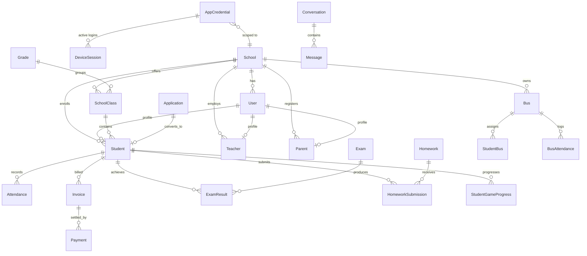

# WeCircle — Codebase & System Analysis (Phase 1)

> **Document status:** Phase 1 deliverable for the WeCircle graduation-project documentation.
> Every fact below is derived from direct inspection of the source code in this repository
> (commit on branch `main`, analysed 2026-05-31). Items that could not be confirmed from code are
> collected in **§11 Open Questions** rather than guessed.
>
> **Scope note:** Where the repository's own `README`, takeover brief, or `CLAUDE.md` disagree with
> the source code, the **source code is treated as ground truth** and the discrepancy is recorded in
> §10.

---

## 1. System Overview

WeCircle is a **multi-tenant school-management platform** composed of three deployable components
that share a single PostgreSQL database (owned by the backend):

| # | Component | Technology | Role | Consumers |
|---|-----------|-----------|------|-----------|
| 1 | **REST API backend** | Node.js + Express 5 + TypeScript + Prisma 6 | Single source of truth; business logic, persistence, auth, realtime, AI, file storage | Web dashboard + mobile app |
| 2 | **Web admin dashboard** | Next.js 16 (App Router) + React 19 | Staff-facing administration UI (school admin, accountant, admissions officer, etc.) | School staff |
| 3 | **Mobile application** | Flutter 3 / Dart 3 | Parent / Student / Teacher / Driver / Supervisor app | End users |

The platform is **multi-tenant by `schoolId`**: almost every table carries a `schoolId` foreign key
and a `tenantScope` middleware enforces row-level isolation per school. A `SUPER_ADMIN` role
transcends tenants.

**Two parallel authentication systems** coexist (this is a defining architectural characteristic):

- **Web dashboard** users authenticate through **AWS Cognito** (id-token verified with
  `aws-jwt-verify`), backed by `User` rows.
- **Mobile** users authenticate with **backend-issued JWTs** derived from `AppCredential` rows
  (login-ID + password), independent of Cognito.

Public endpoints (base URLs in production):

- API: `https://api.wecircle.helpers-tech.com` (routes mounted under `/api`)
- Dashboard: `https://dashboard.wecircle.helpers-tech.com`

---

## 2. Technology Stack & Versions

Versions are taken verbatim from the dependency manifests
(`dashboard/backend/package.json`, `dashboard/frontend/package.json`, `mobile/pubspec.yaml`).

### 2.1 Backend (`dashboard/backend`)

| Concern | Library | Version (declared) |
|---------|---------|--------------------|
| Runtime / language | Node.js, TypeScript | Node 24 target; TypeScript `^5.9.3` |
| Web framework | Express | `^5.1.0` |
| ORM | Prisma Client / Prisma CLI | `^6.17.1` / `6.17.1` |
| Database | PostgreSQL | (via `DATABASE_URL`) |
| Realtime | Socket.IO + Redis adapter | `^4.8.3` + `@socket.io/redis-adapter ^8.3.0`, `ioredis ^5.4.2` |
| Auth (web) | `aws-jwt-verify` | `^5.1.1` |
| Auth (mobile) | `jsonwebtoken` | `^9.0.2` |
| AWS SDK v3 | Cognito IdP, S3, S3 presigner, Bedrock Runtime | `^3.1056.0` (each) |
| AI | AWS Bedrock (Converse API + tool use) | via `@aws-sdk/client-bedrock-runtime` |
| Push | `firebase-admin` (FCM) | `^12.7.0` |
| Validation | `zod` | `^4.1.12` |
| Security middleware | `helmet`, `cors` | `^8.1.0`, `^2.8.5` |
| HTTP client | `axios` | `^1.15.2` |
| Logging | `morgan` | `^1.10.1` |
| Config | `dotenv` | `^17.2.3` |
| Dev tooling | `tsx`, `ts-node-dev` | `^4.20.6`, `^2.0.0` |

> `@google/generative-ai ^0.24.1` is declared and `GOOGLE_AI_API_KEY` lingers in env examples, but
> **no Gemini code path is wired** — the active AI integration is **AWS Bedrock** (§7.3).

### 2.2 Frontend (`dashboard/frontend`)

| Concern | Library | Version |
|---------|---------|---------|
| Framework | Next.js (App Router) | `^16.2.4` |
| UI runtime | React / React-DOM | `^19.2.4` |
| Data fetching | `@tanstack/react-query` | `^5.90.3` |
| HTTP | `axios` | `^1.12.2` |
| Auth client | `amazon-cognito-identity-js` | `^6.3.16` |
| Styling | Tailwind CSS | `^4.1.14` |
| Animation | `framer-motion`, `lottie-react` | `^12.38.0`, `^2.4.1` |
| Charts | `recharts` | `^3.2.1` |
| Forms | `react-hook-form` + `@hookform/resolvers` + `zod` | `^7.65.0` / `^5.2.2` / `^4.1.12` |
| PDF export | `jspdf`, `jspdf-autotable` | `^4.2.1`, `^5.0.7` |
| Markdown | `react-markdown`, `remark-gfm` | `^10.1.0`, `^4.0.1` |
| Realtime | `socket.io-client` | `^4.8.3` |
| Icons | `lucide-react` | `^1.8.0` |
| Language | TypeScript | `~6.0.2` |

> The repo still declares stray Vite/react-router-era tooling in places; the **active build is
> Next.js** (`next dev` / `next build`).

### 2.3 Mobile (`mobile`, pubspec name `wesal`)

| Concern | Package | Version |
|---------|---------|---------|
| SDK | Flutter / Dart | Dart SDK `^3.10.7` |
| HTTP / REST | `http` | `^1.6.0` |
| Local storage | `shared_preferences` | `^2.5.2` |
| Push (FCM) | `firebase_core`, `firebase_messaging` | `^3.8.0`, `^15.1.5` |
| UI / animation | `lottie`, `flutter_animate`, `smooth_page_indicator`, `curved_navigation_bar` | `^3.3.2`, `^4.5.2`, `^2.0.1`, `^1.0.6` |
| Responsive | `flutter_screenutil` | `^5.9.3` |
| Media | `image_picker`, `path_provider` | `^1.2.1`, `^2.1.5` |
| Documents | `pdf`, `printing` | `^3.12.0`, `^5.14.3` |
| Web/links | `url_launcher`, `webview_flutter` | `^6.3.1`, `^4.10.0` |
| i18n | `intl`, `flutter_localizations` | `^0.20.2`, SDK |
| Splash/icons | `flutter_native_splash`, `flutter_launcher_icons` | `^2.4.7`, `^0.14.4` |

> **No `cloud_firestore` dependency exists.** Firebase is used **only for push notifications**
> (`firebase_messaging`). Chat is served by the backend REST API + Socket.IO, not Firestore
> (corrects the `CLAUDE.md`/brief claim — see §10).

---

## 3. Architecture

### 3.1 Style

- **Client–server, multi-tier:** thick backend (sole DB owner) with two thin clients.
- **Modular monolith (layered) on the backend:** the backend has been **fully migrated** to a
  feature-module layout under `src/modules/<feature>/`, each module exposing `*.routes.ts` →
  `*.controller.ts` (and, where present, `*.service.ts`). This corrects the `CLAUDE.md` claim that
  only `modules/student` was migrated and a "legacy flat `controllers/`" directory remained — **no
  `src/controllers/` directory exists** in the current tree.
- **Multi-tenant SaaS:** logical isolation per `schoolId` enforced in middleware, not by separate
  databases/schemas.
- **Event-driven realtime:** Socket.IO rooms (`school:<id>`, `user:<id>`, `super_admin`) broadcast
  live updates (e.g., bus GPS) to clients in the same tenant.

### 3.2 Backend folder structure (`dashboard/backend/src`)

```
src/
├── server.ts                     # Express app bootstrap, helmet/cors/morgan, WS init, cron init
├── config/
│   ├── env.ts                    # Centralised, validated environment config
│   ├── prisma.ts                 # Prisma client singleton
│   └── websocket.ts              # Socket.IO server + optional Redis adapter + room logic
├── routes/index.ts               # Mounts all 37 feature route-modules under /api
├── core/
│   ├── http/middlewares/         # auth, mobileAuth, roleGuard, tenantScope, errorHandler
│   └── utils/                    # AppError, asyncHandler, sessionStore, tenant (requireSid)
├── modules/<feature>/            # 37 feature modules (routes + controller [+ service])
│   ├── auth, student, teacher, parent, class, subject, academic, admission,
│   ├── attendance, homework, exam, timetable, payment, invoice, feeStructure,
│   ├── transport, mobileTransport, announcement, notification, chat, ai, zoom,
│   ├── credential, dashboard, reports, settings, school, result, archive, leave,
│   ├── schedule, behavior, dailyReport, studentTask, storage, user
├── services/                     # notification.service.ts, push.service.ts (FCM)
├── cron/checkOverdueInvoices.ts  # hourly overdue-invoice sweep (in-process or EventBridge)
└── types/express.d.ts            # Request augmentation (req.user, req.schoolId, req.*Id, req.token)
```

### 3.3 Frontend folder structure (`dashboard/frontend/src`)

```
src/
├── app/                          # Next.js App Router
│   ├── login / register / verify / forgot-password / update-password
│   └── dashboard/                # ~30 admin pages (students, teachers, parents, attendance,
│                                 #   payments/invoices, admissions, classes, grades, subjects,
│                                 #   timetable, exams, homework, behavior, transport, drivers,
│                                 #   supervisors, announcements, notifications, messages, reports,
│                                 #   leaves, schedules, settings, users, credentials, archive,
│                                 #   academic-years, communication/zoom)
├── core/
│   ├── api/apiClient.ts          # axios instance + Cognito token interceptor + S3 upload helper
│   ├── auth/cognito.ts           # CognitoUserPool config
│   ├── config/env.ts             # NEXT_PUBLIC_* config
│   ├── realtime/socketClient.ts  # Socket.IO client
│   └── i18n/i18n.ts              # AR/EN localisation
├── modules/{auth,dashboard}/components   # AI chat assistant, analytics, wizards, modals
└── shared/{components,ui}        # AuthProvider, QueryProvider, StatCard, Modal, theme/lang toggles
```

### 3.4 Mobile folder structure (`mobile/lib`)

```
lib/
├── main.dart                     # Entry point, route table, Firebase/push init
├── firebase_options.dart         # FCM config
├── core/{api,config,state,theme} # api_service.dart, api_config.dart (REST base URL)
├── services/                     # api_service.dart, chat_service.dart (REST /chat/mobile), push_service.dart
├── models/                       # message_model, mission_model
├── widgets/                      # shared + student1-3 gamified widgets
└── screens/
    ├── parent/                   # dashboard, homework, fees, results, schedule, bus_tracker,
    │                             #   messages/chat, behavior reports, tips, activities, profile
    ├── teacher/                  # dashboard, attendance, grades, daily/behavior reports, tasks, messages
    ├── driver/                   # dashboard, messages
    ├── student1-3/               # gamified UI for grades 1–3 (space/galaxy theme)
    ├── student4-6/               # gamified UI for grades 4–6 (hero/mission theme)
    └── student_shared/           # game data, intro, AI chatbot
```

---

## 4. Data Model

Source: `dashboard/backend/prisma/schema.prisma` (provider `postgresql`, ~45 models + 24 enums).
IDs are UUID strings (`@default(uuid())`). Monetary fields use `Decimal(12,2)`. Timestamps use
`createdAt`/`updatedAt`.

### 4.1 Enumerations

`Role` (SUPER_ADMIN, SCHOOL_ADMIN, ADMISSION_OFFICER, STUDENT_AFFAIRS, ACCOUNTANT, BUS_SUPERVISOR,
DRIVER, TEACHER, STUDENT, PARENT), `Gender`, `ApplicationStatus`, `DocumentStatus`, `StudentStatus`,
`TeacherStatus`, `ContractType`, `PaymentMethod`, `FeeType`, `PaymentStatus`, `PaymentPlan`,
`ExamType`, `AttendanceStatus`, `AttendanceType`, `NotificationChannel`, `NotificationType`,
`AttendanceMode`, `BusStatus`, `HomeworkStatus`, `InvoiceStatus`, `LeaveStatus`, `ResidenceProofType`,
`ApplicationType`, `MaritalStatus`, `BusAttendanceStatus`, `BehaviorType`.

### 4.2 Entities grouped by domain

**Core / tenancy**
- **School** — tenant root (`code` unique, `name` unique, branding: `logo`, `stamp`, contact). Parent
  of nearly every other table.
- **User** — Cognito-backed identity (`email` unique, `role`, optional `schoolId`); 1:1 optional links
  to Student / Teacher / Parent / Driver / BusSupervisor profiles.
- **AppCredential** — mobile login record (`loginId` unique, `loginEmail?`, `passwordHash`,
  `plainTextPw?`, `role`, `isActive`, social IDs `googleId`/`appleId`); FK to one of
  student/teacher/parent/driver/supervisor.
- **DeviceSession** — durable mobile session store (token-keyed; replaces file-based
  `device_sessions.json`).
- **DeviceToken** — FCM push registration tokens (per device per user).
- **SchoolSettings** — per-school config (language, currency EGP, timezone, attendance mode, working
  days, periods/day, notification toggles, SMS/email/WhatsApp templates, Zoom OAuth credentials, AI
  agent password).
- **ActivityLog** — audit trail (`action`, `module`, `details`, `ipAddress`).
- **Archive** — JSON snapshots of soft-deleted entities for restore.

**Academic structure**
- **AcademicYear** (`isCurrent`), **Grade** (order 1–6, AR/EN names), **SchoolClass**
  (section, capacity, room, supervisor teacher), **Subject** (max/pass score),
  **TeacherSubject** (teacher↔subject↔class assignment, unique triple).

**Admissions** (`Application` aggregate root + 8 child tables)
- **Application** (child data, `applicationType`, `status`, links to converted Student) with
  one-to-one children **ApplicationFather / Mother / Guardian / Residence / Interview** and
  one-to-many **ApplicationDocument / ApplicationFee / ApplicationStatusLog / ApplicationContact**.

**People**
- **Student** (personal + academic fields, `status`, `useBus`, `points` for gamification; FKs to
  class/grade/academicYear; father/mother/guardian parent FKs).
- **Teacher** (personal, professional, salary, status, document URLs).
- **Parent** (contact, relationship; many-to-many-ish via father/mother/guardian relations to
  Student).
- **Driver**, **BusSupervisor** (personal, license/qualification, document URLs, optional `busId`).

**Attendance & academics**
- **Attendance** (polymorphic by `AttendanceType` STUDENT/TEACHER/...; daily or periodic; status).
- **Homework** + **HomeworkSubmission** (unique per homework+student).
- **Exam** + **ExamResult** (unique per exam+student; `approved`, `locked`).
- **Timetable** (class/subject/teacher slot by day + period).

**Finance**
- **FeeStructure** (per grade/year/student), **Invoice** (totals, discount, paid, remaining, status,
  payment plan), **Payment** (method, receipt, status, links to invoice), **Expense**.

**Transport**
- **Bus** (capacity, status, last GPS `lastLat`/`lastLng`/`locationUpdatedAt`), **BusRoute**
  (`stops` JSON, pickup/dropoff times), **StudentBus** (assignment, points, fees),
  **BusAttendance** (boarded/absent/excused per student/date/bus).

**Communication**
- **Announcement** (audience targeting, pinned, expiry), **Notification** (type, channel, read state),
  **Conversation** + **Message** (deterministic `pairKey` to dedupe DM threads), **CalendarEvent**.

**Teacher extensions & gamification**
- **BehaviorReport** (positive/negative/followup, traits, rich JSON `content`),
  **DailyReport** (interaction/attention/participation metrics), **StudentTask** +
  **StudentTaskCompletion** (reward points), **StudentGameProgress** (per-student per-game 1–5 level
  + points), **LeaveRequest**, **SchoolResult** (published result files), **AiChatMessage** (AI
  assistant history per session).

### 4.3 Key relationships (Mermaid — for reference; final ERD produced in Phase 3)



---

## 5. API Surface

All routes are mounted under **`/api`** (`server.ts` → `routes/index.ts`). Response envelope is
`{ success: boolean, message?, data?/... }`. Auth column legend:
**Cognito** = `requireAuth` (custom-JWT-or-Cognito) · **+Tenant** = also `tenantScope` ·
**Role(...)** = `roleGuard` restriction · **Mobile** = `requireMobileAuth` (AppCredential JWT) ·
**Public** = no auth · **Secret** = shared-header secret.

### 5.1 System & Auth

| Method | Path | Purpose | Auth |
|--------|------|---------|------|
| GET | `/api/health` | Health probe | Public |
| GET | `/api/` (root) | Service banner / version | Public |
| POST | `/api/internal/cron/check-overdue` | Trigger overdue-invoice sweep | Secret (`X-Cron-Secret`) |
| POST | `/api/auth/login` | **Disabled** (throws; Cognito-only) | Public |
| POST | `/api/auth/register` | Self-register a PARENT `User` | Public |
| POST | `/api/auth/cognito-sync` | Verify Cognito id-token, hydrate/auto-create DB user | Public (token-gated) |
| POST | `/api/auth/webhook` | Legacy user upsert | Public |
| GET | `/api/auth/check-school-id/:code` | School-code availability | Public |
| GET | `/api/auth/check-school-name/:name` | School-name availability | Public |
| GET | `/api/auth/check-school-email/:email` | Email availability | Public |
| GET | `/api/auth/me` | Current Cognito user profile | Cognito |
| POST | `/api/auth/mobile/login` | Mobile credential login → JWT | Public |
| POST | `/api/auth/mobile/social-login` | Google/Apple linked login → JWT | Public |
| POST | `/api/auth/mobile/change-password` | Change AppCredential password | Mobile |

### 5.2 Students, Staff & Academic structure

| Method | Path | Purpose | Auth |
|--------|------|---------|------|
| GET/POST/GET/PUT/DELETE | `/api/students` , `/api/students/:id` | CRUD students (write = Role SCHOOL_ADMIN/SUPER_ADMIN) | +Tenant (+Role on write) |
| GET/POST | `/api/students/mobile/game-state` | Read/persist gamification state | Mobile |
| POST | `/api/students/mobile/ai-chat` | Student AI chatbot | Mobile |
| GET/POST/PUT/DELETE | `/api/teachers` , `/api/teachers/:id` | CRUD teachers (write = SUPER_ADMIN) | +Tenant (+Role) |
| GET/POST/DELETE | `/api/teachers/:id/assignments` | Manage class↔subject assignments | +Tenant (+Role) |
| GET (×3), PUT, POST (×5), GET (devices/social) | `/api/teachers/mobile/*` | Teacher mobile dashboard, reports, classes, profile, password, devices, social linking | Mobile |
| GET/PATCH/POST | `/api/parents` , `/api/parents/:id`, `/api/parents/students/:studentId/attach` | List/update parents, attach to student | +Tenant |
| GET/PUT/POST | `/api/parents/mobile/*` | Parent dashboard, profile, password, devices, social linking | Mobile |
| GET/POST/DELETE | `/api/classes` | List/create/delete classes (write = SUPER_ADMIN) | +Tenant (+Role) |
| GET/POST/POST/DELETE | `/api/subjects` (+`/bulk`) | Manage subjects | +Tenant |
| GET/POST/PUT/DELETE | `/api/academic/years` , `/grades` (+`/grades/seed`) | Academic years & grades | +Tenant |
| GET/PATCH | `/api/users` , `/api/users/:id/role` | List users, change role | +Tenant |
| GET/PATCH | `/api/school/me` | Read/update own school profile | +Tenant |
| GET/PATCH | `/api/settings` | Read/update school settings | +Tenant |
| GET | `/api/dashboard/overview` | KPI overview cards | +Tenant |
| GET | `/api/reports/overview` | Aggregated reports | +Tenant |
| GET | `/api/storage/presign` | S3 presigned upload URL | Cognito |

### 5.3 Admissions

| Method | Path | Purpose | Auth |
|--------|------|---------|------|
| GET | `/api/admissions` | List applications | Cognito |
| GET | `/api/admissions/stats` | Admission funnel stats | Cognito |
| GET | `/api/admissions/:id` | Application detail | Cognito |
| POST | `/api/admissions` | Create application | Cognito |
| PUT | `/api/admissions/:id` | Update application | Cognito |
| PATCH | `/api/admissions/:id/status` | Change status (logged) | Cognito |
| POST | `/api/admissions/:id/convert` | Convert to enrolled student | Cognito |
| POST | `/api/admissions/:id/contact` | Add contact-log entry | Cognito |
| DELETE | `/api/admissions/:id` | Delete application | Cognito |

### 5.4 Attendance, Homework, Exams, Timetable

| Method | Path | Purpose | Auth |
|--------|------|---------|------|
| GET/POST/POST | `/api/attendance` (+`/bulk`) | List/create/bulk attendance | +Tenant |
| GET/POST | `/api/attendance/mobile` (+`/mobile/bulk`) | Teacher mobile attendance | Mobile |
| GET/POST/PATCH/DELETE | `/api/homework` , `/api/homework/:id` | Manage homework | +Tenant |
| POST/GET | `/api/homework/:id/submit` , `/:id/submissions` | Submit / list submissions | +Tenant |
| GET | `/api/homework/mobile/student/:studentId` | Student/parent homework feed | Mobile |
| GET/POST/PATCH/DELETE | `/api/exams` , `/api/exams/:id` | Manage exams | +Tenant |
| POST/GET | `/api/exams/:id/results` , `/api/exams/student/:studentId` | Save/read results | +Tenant |
| GET/POST/GET | `/api/exams/mobile/*` | Teacher classes, result entry, student results | Mobile |
| GET/POST/DELETE | `/api/timetable` (+`/auto-generate`) | Manage timetable | +Tenant |
| GET | `/api/timetable/mobile/student` , `/mobile/my-schedule` | Student & teacher schedules | Mobile |

### 5.5 Finance

| Method | Path | Purpose | Auth |
|--------|------|---------|------|
| GET/POST | `/api/payments` | List / record payment (create = SUPER_ADMIN) | +Tenant (+Role) |
| GET/POST/POST | `/api/invoices` (+`/bulk`) | List/create/bulk invoices | Cognito |
| PATCH | `/api/invoices/:id/pay` , `/discount` , `/toggle-access` , `/deadline` | Invoice operations | Cognito |
| DELETE | `/api/invoices/:id` | Delete invoice | Cognito |
| GET | `/api/invoices/mobile/student/:studentId` | Parent invoice view | Mobile |
| GET/POST/DELETE | `/api/fee-structures` | Manage fee structures | +Tenant |

### 5.6 Transport (web + mobile)

| Method | Path | Purpose | Auth |
|--------|------|---------|------|
| GET/POST/DELETE | `/api/transport/buses` (+`/:id/trip`, `/:id/students`) | Manage buses, toggle trip, assign students | +Tenant |
| GET/POST/DELETE | `/api/transport/routes` | Manage routes | +Tenant |
| GET/POST/PUT/DELETE | `/api/transport/drivers` , `/supervisors` | Manage drivers & supervisors | +Tenant |
| GET | `/api/transport/students` | Transport-eligible students | +Tenant |
| POST | `/api/transport/mobile/location` | Driver pushes GPS → Bus + WS broadcast | Mobile |
| GET | `/api/transport/mobile/bus-status` | Parent reads child's bus + last location | Mobile |
| GET/PUT/POST | `/api/mobile/transport/driver/*` | Driver dashboard, profile, location, attendance | Mobile |
| GET/POST/PUT | `/api/mobile/transport/supervisor/*` | Supervisor dashboard, bus attendance, profile | Mobile |

### 5.7 Communication, Reports & Misc

| Method | Path | Purpose | Auth |
|--------|------|---------|------|
| GET/POST/DELETE | `/api/announcements` | List/create/delete (create = SUPER_ADMIN/TEACHER; delete = SUPER_ADMIN) | +Tenant (+Role) |
| GET/POST/POST/DELETE | `/api/notifications` (+`/:id/read`) | List/send/read/delete notifications | +Tenant |
| POST/DELETE | `/api/notifications/mobile/device-token` | Register/unregister FCM token | Mobile |
| GET/POST/GET/GET/POST | `/api/chat` (+`/contacts`, `/:id/messages`) | Conversations & messaging (web) | +Tenant |
| (mirror) | `/api/chat/mobile/*` , `/api/conversations` (alias) | Mobile chat + legacy alias | Mobile / +Tenant |
| POST/GET (+mobile) | `/api/behavior` , `/api/behavior/mobile/*` | Behavior reports (teacher/parent views) | Cognito / Mobile |
| POST/GET (+mobile) | `/api/daily-reports` | Daily class reports | Cognito / Mobile |
| POST/GET/POST/DELETE | `/api/student-tasks` (+`/:id/complete`) | Tasks & completions | Cognito |
| GET/POST/PATCH | `/api/leaves` (+`/:id/status`) | Leave requests | Cognito |
| GET/POST/DELETE | `/api/schedules` | Calendar events | Cognito |
| GET/POST/DELETE | `/api/results` | Published result files | +Tenant |
| GET/POST | `/api/credentials` (+`/generate`, `/bulk-generate`, `/:id/toggle`, `/:id/reset-password`) | Manage mobile login credentials | Cognito |
| GET/POST | `/api/archives` (+`/:id/restore`) | Soft-delete archive & restore | Cognito |
| POST/GET/DELETE | `/api/zoom/meetings` | Zoom meeting management (S2S OAuth) | Cognito |

### 5.8 AI Assistant

| Method | Path | Purpose | Auth |
|--------|------|---------|------|
| POST | `/api/ai/chat` | Bedrock Converse chat with DB tool-use | Cognito |
| GET | `/api/ai/history` , `/api/ai/sessions` | Chat history / session list | Cognito |
| DELETE | `/api/ai/sessions/:sessionId` | Delete a session | Cognito |
| GET/POST/POST | `/api/ai/password-status` , `/set-password` , `/verify-password` | AI-agent gate password | Cognito |

> **Total:** 37 mounted route-modules. Web/dashboard endpoints use `requireAuth` (+`tenantScope`);
> mobile endpoints use `requireMobileAuth`; several modules expose **both** a web and a `/mobile/*`
> surface backed by the same controller.

---

## 6. User Roles & Permissions

`Role` enum has 10 values. Enforcement is via `roleGuard([...])` on specific write routes plus
`tenantScope` for data isolation; **mobile role behaviour is enforced by `requireMobileAuth` and the
role embedded in the AppCredential JWT** (limited to STUDENT/TEACHER/PARENT/DRIVER, plus supervisor
context).

| Role | Surface | Capabilities observed in code |
|------|---------|-------------------------------|
| **SUPER_ADMIN** | Web | Bypasses `tenantScope` (can target any school via `x-school-id`/query); only role permitted to create/update/delete teachers, classes, payments, teacher-assignments, and delete announcements. Sees school counts. |
| **SCHOOL_ADMIN** | Web | Full school administration; explicitly allowed to create/update/delete **students** (shared with SUPER_ADMIN). Other staff CRUD is reachable through `requireAuth`+`tenantScope` without a finer role gate. |
| **ADMISSION_OFFICER** | Web | Intended for admissions workflow (admissions routes are `requireAuth`-only, not role-gated). |
| **STUDENT_AFFAIRS** | Web | Student-records oriented staff role (no dedicated `roleGuard` beyond auth+tenant). |
| **ACCOUNTANT** | Web | Finance-oriented staff role (invoice routes are auth-only; payment **create** is SUPER_ADMIN-gated). |
| **TEACHER** | Web + Mobile | Web: may create announcements. Mobile: dashboard, classes, attendance, homework, exam results, behavior/daily reports, tasks, chat, profile/devices/social. |
| **PARENT** | Web (default) + Mobile | Default role auto-assigned on Cognito sync/register. Mobile: child dashboard, homework, fees/invoices, results, schedule, bus status, behavior reports, chat. |
| **STUDENT** | Mobile | Gamified dashboards (grades 1–3 / 4–6), game-state persistence, AI chatbot, results, homework. |
| **DRIVER** | Mobile | Driver dashboard, GPS location push, bus attendance, profile, chat. |
| **BUS_SUPERVISOR** | Mobile | Supervisor dashboard, bus attendance marking, profile. |

**Observed gating gaps** (reported, not invented): many staff-write routes (invoices, admissions,
subjects, fee-structures, academic years/grades, settings) are protected by **authentication +
tenant scope only**, without a per-role `roleGuard`. This is recorded in §11 for the
analysis/limitations discussion.

---

## 7. Third-Party Integrations & External Services

| Service | Where | Purpose |
|---------|-------|---------|
| **AWS Cognito** | `core/http/middlewares/auth.ts`, `auth.controller.ts` (`cognito-sync`), frontend `core/auth/cognito.ts` | Web user identity; id-token verification (`aws-jwt-verify`); requires `email_verified`. |
| **AWS S3** | `modules/storage/storage.controller.ts`, frontend `uploadToS3` | Presigned-URL (PUT) uploads; public-URL convention `https://<bucket>.s3.<region>.amazonaws.com/<key>`. |
| **AWS Bedrock** | `modules/ai/ai.controller.ts` | AI assistant via Converse API + **tool use** (query/create/update/delete school data). Model from `BEDROCK_MODEL_ID`, default **`amazon.nova-2-lite-v1:0`** (per `config/env.ts`). |
| **Firebase Cloud Messaging** | backend `services/push.service.ts` (`firebase-admin`), mobile `firebase_messaging` | Push notifications; **graceful no-op** when no service-account is configured. |
| **Socket.IO (+ optional Redis adapter)** | `config/websocket.ts` | Realtime events (e.g., `bus:location`) scoped to `school:<id>` rooms; Redis adapter enabled only when `REDIS_URL` is set (multi-instance scaling). |
| **Zoom (Server-to-Server OAuth)** | `modules/zoom`, `SchoolSettings.zoom*` | Online-class meeting creation; per-school credentials. |
| **ip-api.com** | `auth.controller.ts` (mobile login) | Reverse-geolocates the client IP to label device sessions (external HTTP call in the login path). |
| **EventBridge Scheduler (Lambda)** | `routes/index.ts` `/internal/cron/check-overdue` | External trigger for the overdue-invoice cron (protected by `CRON_SECRET`). |

---

## 8. Configuration & Deployment

### 8.1 Backend environment (`config/env.ts`, `.env.example`)

Required: `JWT_SECRET`, `DATABASE_URL`, `SUPER_ADMIN_EMAIL`, `COGNITO_USER_POOL_ID`,
`COGNITO_CLIENT_ID`. With fallbacks: `AWS_REGION` (`us-east-1`), `AWS_S3_BUCKET_NAME` (`local`),
`PORT` (`5001`), `NODE_ENV`, `ALLOWED_ORIGINS`/`FRONTEND_URL`. Optional: `REDIS_URL`, `CRON_SECRET`,
`DISABLE_INPROCESS_CRON`, `BEDROCK_MODEL_ID`, `FIREBASE_SERVICE_ACCOUNT[_PATH]`, `GOOGLE_AI_API_KEY`
(unused), `AWS_ACCESS_KEY_ID`/`AWS_SECRET_ACCESS_KEY` (IAM role preferred in prod).

### 8.2 Frontend environment (`.env.example`)

`NEXT_PUBLIC_API_URL`, `NEXT_PUBLIC_AWS_REGION`, `NEXT_PUBLIC_COGNITO_USER_POOL_ID`,
`NEXT_PUBLIC_COGNITO_CLIENT_ID`, `NEXT_PUBLIC_APP_NAME`, `NEXT_PUBLIC_APP_URL`.

### 8.3 Mobile configuration

`API_URL` via `--dart-define` (default `https://api.wecircle.helpers-tech.com/api`); FCM via
`firebase_options.dart` + `google-services.json`.

### 8.4 Deployment (`.github/workflows/deploy.yml`)

- **Trigger:** push to `main`.
- **Gate job:** backend `npm ci → prisma generate → npm run build` and frontend `npm ci → npm run
  build` (typecheck/lint gate).
- **Deploy job:** SSH to a **single EC2 instance**; `git fetch && git reset --hard origin/main`;
  inject `JWT_SECRET`/Cognito secrets into `.env`; `prisma generate`; run a data-cleanup SQL,
  `prisma migrate resolve` + **`prisma migrate deploy`**; `npm run build`; (re)start **backend** and
  **Next.js frontend** under **pm2** on the same box. (nginx + Certbot TLS front both domains per
  project notes.)

> The workflow's use of `prisma migrate deploy` and named migration resolution indicates a **Prisma
> migrations history is now in use** (the earlier "no migrations dir / `db push` only" note is stale
> — see §10 / §11).

### 8.5 Build commands

- Backend: `npm run dev` (tsx watch, `:5001`), `npm run build` (tsc → `dist/`), `npm start`,
  `npm run seed`.
- Frontend: `npm run dev` (`:3000`), `npm run build`, `npm start`.
- Mobile: `flutter pub get`, `flutter analyze`, `flutter run --dart-define=API_URL=...`.

---

## 9. Design Patterns & Security Measures

**Design patterns**
- **Layered feature modules** (routes → controller → service/repository) — Prisma acts as the
  repository/data-mapper layer; `invoice` and `notification`/`push` have explicit service files.
- **Centralised error handling** — `AppError` subclasses (`ValidationError`, `AuthenticationError`,
  `ConflictError`, `NotFoundError`, `ForbiddenError`) + `errorHandler` middleware; `asyncHandler`
  wraps controllers to funnel rejections.
- **Middleware chain / chain-of-responsibility** — `requireAuth`/`requireMobileAuth` → `tenantScope`
  → `roleGuard` → controller.
- **Singletons** — Prisma client, Socket.IO server (`getIO()` returns a no-op proxy before init).
- **Request augmentation** — `types/express.d.ts` adds `req.user`, `req.schoolId`, `req.{teacher,
  parent,student,driver,supervisor}Id`, `req.token`.
- **Schema-first validation** — Zod schemas at controller boundaries.
- **Tool-use AI agent** — Bedrock Converse loop (max 5 tool iterations) exposing
  query/create/update/delete over Prisma models, hard-scoped to the caller's `schoolId`.

**Security measures (as implemented)**
- Helmet security headers; CORS restricted to an allow-list (`ALLOWED_ORIGINS`); JSON/body size
  capped at 1 MB.
- Web auth = Cognito id-token verification; `cognito-sync` **requires `email_verified === true`** and
  **never** elevates role from token claims (new users default to PARENT).
- Direct password login on web is **disabled** (Cognito is the only path).
- Multi-tenant isolation via `tenantScope`; SUPER_ADMIN explicitly handled.
- Mobile JWT (30-day expiry) + **server-side device-session validation** for PARENT/TEACHER
  (revocable logout; sessions revoked on password change).
- Internal cron endpoint gated by `X-Cron-Secret`.
- Audit logging via `ActivityLog`; soft-delete + restore via `Archive`.

**Security weaknesses to disclose honestly** (from code, for Ch. 5/6/7 limitations)
- Mobile passwords are hashed with **unsalted SHA-256** (`crypto.createHash("sha256")`) — fast hash,
  no salt/work-factor (bcrypt/argon2 would be appropriate).
- `AppCredential.plainTextPw` **stores the plaintext password** (for admin re-sharing) and is
  re-written on password change.
- `SchoolSettings.aiAgentPassword` and the Zoom client secret are stored **in plaintext**; the AI
  password code even contains a comment acknowledging it should be hashed.
- The AI assistant is granted **full CRUD over the tenant's data** through tool use — powerful and
  convenient, but a broad blast radius if prompt-injected.
- `requireAuth` verifies a **custom JWT first**, then falls back to Cognito; forged custom tokens are
  rejected unless signed with `JWT_SECRET`, but the dual-trust path is worth documenting.

---

## 10. Corrections to Existing Repository Docs (verified reality)

| Claim in `CLAUDE.md` / brief / README | Verified reality in code |
|----------------------------------------|--------------------------|
| Backend is "legacy flat `controllers/`", only `student` migrated | **Fully modular** `src/modules/*`; no `controllers/` dir exists |
| Mobile chat uses **Firestore** (`cloud_firestore`) | Chat uses backend **REST `/chat/mobile` + Socket.IO**; `cloud_firestore` is **not a dependency** |
| Firebase is "the DB" / used for chat | Firebase = **FCM push only** (`firebase_messaging`/`firebase-admin`), with graceful no-op fallback |
| Bedrock model default `amazon.nova-lite-v1:0` | Code default is **`amazon.nova-2-lite-v1:0`** (`config/env.ts`) |
| "No migrations dir; `db push` only; history lost" | Deploy pipeline runs **`prisma migrate deploy`** and resolves named migrations → a migrations history is in use |
| Mobile auth via Firebase | Mobile auth = **backend-signed JWT** from `AppCredential` + `DeviceSession` store |

---

## 11. Open Questions / Items to Confirm

These are unresolved from code alone and must be answered before or during write-up (they will be
tracked in `docs/README.md`):

**A. Documentation metadata — ✅ RESOLVED (provided by author 2026-05-31)**
1. University / Faculty / Department — **International Academy for Engineering and Media Science
   (IAEMS) / Mass Communication**.
2. Program / Degree — **Bachelor's in Mass Communication, Major in Multimedia and Web/Mobile App
   Development**.
3. Academic year & semester — **Senior Year / Spring 2026 (Graduation Project Semester)**.
4. Team members — **Maryam Khamis, Karim El-Saeed, Fadi Emad, Adham El-Shater, Jihad Haggag, Sandy
   Tharwat** (student ID numbers still **TBD** — placeholder on title page).
5. Supervisor — **Dr. Nabil Al-Ghamry**.
6. Documentation language — **Bilingual: English primary + Arabic abstract**.
7. Citation style — **IEEE**.
8. Target length — **70–100 pages**.

**B. Project facts**
9. Prisma `migrations/` directory — ✅ **RESOLVED: committed** at
   `dashboard/backend/prisma/migrations/` (10 migrations, `20260529000000_init` →
   `20260530000009_device_tokens`); deployed via `prisma migrate deploy`.
10. `directUrl`/`DIRECT_URL` Supabase leftover — ✅ **RESOLVED: removed.** The schema `datasource db`
    block declares only `url = env("DATABASE_URL")`.
11. Automated tests — ✅ **RESOLVED: none of substance.** No `*.test.ts`/`*.test.tsx` in backend or
    frontend `src`; mobile contains only Flutter's scaffold `test/widget_test.dart`. **Chapter 6 will
    document a manual/black-box test plan**, stated transparently.
12. Confirm production hosting specifics (single EC2 + pm2 + nginx + Certbot) and whether ECS/Redis are
    live or aspirational (`infra/aws` holds ad-hoc artifacts). *(Still to confirm with author.)*
13. Canonical product name on the title page: **WeCircle** assumed (Flutter package is internally
    `wesal`; backend banner now says "WeCircle"). *(Confirm.)*
14. Are SMS / WhatsApp / Email channels actually delivered, or only modelled in
    `SchoolSettings`/`NotificationChannel`? Templates exist; **no provider integration found** →
    documented as "configurable but not yet wired." *(Confirm.)*
15. Diagram export: confirm whether `mermaid-cli (mmdc)` / `pandoc` are available locally for Phase 3
    image + DOCX/PDF export, else Mermaid-in-Markdown is the final form. *(Will detect in Phase 3.)*

---

### Phase 1 sign-off

This analysis covers: tech stack & versions (§2), per-component structure (§3), architecture style
(§3.1), full data model (§4), complete API surface (§5), roles & permissions (§6), third-party
integrations (§7), configuration & deployment (§8), and design patterns & security (§9), plus
reality corrections (§10) and open questions (§11).

**➡️ Please review this document. On your approval I will proceed to Phase 2 (the documentation
outline, `docs/outline.md`).**
