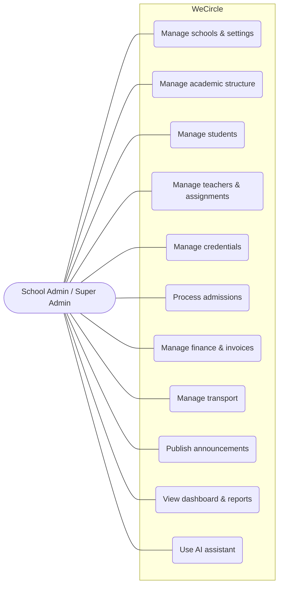
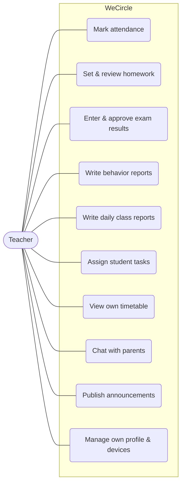
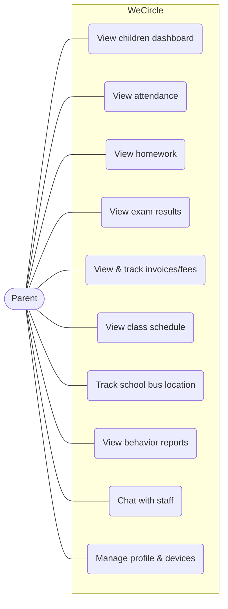
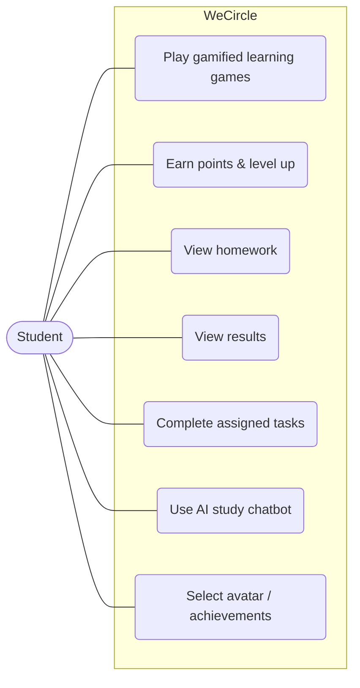
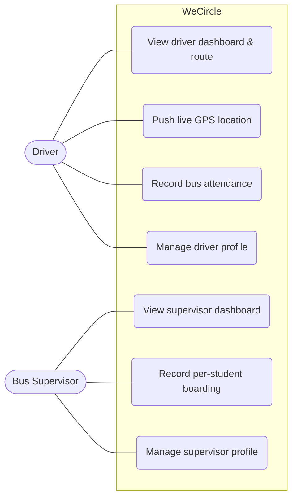

<!-- ============================================================
     CHAPTER 3 — SYSTEM ANALYSIS
     ============================================================ -->

# Chapter 3 — System Analysis

This chapter analyzes *what* WeCircle must do. It identifies the stakeholders, specifies the
functional and non-functional requirements derived from the implemented system, assesses
feasibility, and models the principal interactions as use cases.

## 3.1 Stakeholders & Users

WeCircle defines ten roles (the `Role` enumeration in the data model). Roles map to two access
surfaces: the **web dashboard** (staff) and the **mobile application** (end users). The table below
lists each role, its surface, and its primary goals.

| # | Role | Surface | Primary goals |
|---|------|---------|---------------|
| 1 | **Super Admin** | Web | Operate the platform across all schools; create schools; manage staff, classes, and platform-wide configuration; the only role able to cross tenant boundaries. |
| 2 | **School Admin** | Web | Run a single school day-to-day; manage students, staff, and academic structure; the principal administrative role. |
| 3 | **Admission Officer** | Web | Process admission applications from enquiry to decision and conversion to a student. |
| 4 | **Student Affairs** | Web | Maintain student records, leave requests, and behavior follow-up. |
| 5 | **Accountant** | Web | Manage fee structures, issue invoices, and record payments. |
| 6 | **Teacher** | Web + Mobile | Mark attendance, set homework, enter exam results, write behavior and daily reports, assign tasks, and communicate with parents. |
| 7 | **Parent** | Mobile (default web role) | Follow each child's attendance, homework, results, fees, schedule, behavior, and bus location; communicate with staff. |
| 8 | **Student** | Mobile | Access a gamified learning experience, view results and homework, and use the student AI chatbot. |
| 9 | **Driver** | Mobile | View the assigned route, push live GPS location, and record bus attendance. |
| 10 | **Bus Supervisor** | Mobile | Record per-student bus boarding/absence and manage the supervised bus. |

Secondary stakeholders include **the school as an institution** (the tenant that owns the data) and
**the development/operations team** that maintains the platform.

## 3.2 Functional Requirements

Functional requirements are grouped by module and numbered `FR-<module>-<n>`. They are derived
directly from the implemented backend endpoints and clients (see Appendix B for the full endpoint
catalogue).

### Table 3.1 — Functional Requirements Catalogue

**Authentication & Access Control (AUTH)**
- **FR-AUTH-1** Staff shall authenticate to the web dashboard via AWS Cognito; the backend shall
  verify the identity token and synchronize a local user record only if the email is verified.
- **FR-AUTH-2** End users shall authenticate to the mobile app with a login ID/email and password,
  receiving a signed JWT valid for 30 days.
- **FR-AUTH-3** The system shall support social sign-in (Google/Apple) for mobile credentials that
  have been linked.
- **FR-AUTH-4** The system shall enforce role-based access control on protected operations.
- **FR-AUTH-5** The system shall isolate all data by school (tenant) and prevent cross-tenant access,
  except for the Super Admin.
- **FR-AUTH-6** Parents and teachers shall be able to view active device sessions and remotely log
  out individual or all other devices; changing a password shall revoke existing sessions.

**School, Academic Structure & Settings (CORE)**
- **FR-CORE-1** A Super Admin shall create and configure schools (code, name, branding, contact).
- **FR-CORE-2** Staff shall manage academic years, grades, subjects, and classes for their school.
- **FR-CORE-3** Staff shall configure school settings (language, currency, timezone, working days,
  periods per day, attendance mode, notification toggles, and integration credentials).
- **FR-CORE-4** The system shall provide an administrative dashboard overview and aggregated reports.

**Admissions (ADM)**
- **FR-ADM-1** Staff shall create an admission application capturing child, father, mother, guardian,
  and residence data, with supporting documents.
- **FR-ADM-2** Staff shall track each application through a defined status workflow, recording status
  changes and contact logs.
- **FR-ADM-3** Staff shall view admission statistics (funnel by status).
- **FR-ADM-4** Upon final acceptance, staff shall convert an application into an enrolled student
  without re-entering data.

**Students, Teachers & Parents (PPL)**
- **FR-PPL-1** Staff (School Admin/Super Admin) shall create, update, and delete student records.
- **FR-PPL-2** A Super Admin shall create, update, and delete teacher records and manage
  teacher↔subject↔class assignments.
- **FR-PPL-3** Staff shall manage parents and attach parents (father/mother/guardian) to students.
- **FR-PPL-4** Staff shall generate, bulk-generate, reset, enable/disable, and delete mobile login
  credentials for students, parents, teachers, drivers, and supervisors.

**Attendance (ATT)**
- **FR-ATT-1** Teachers/staff shall record student attendance in daily or periodic mode, individually
  or in bulk, with status (present, absent, late, excused, emergency).
- **FR-ATT-2** The system shall record teacher/staff attendance.
- **FR-ATT-3** Teachers shall mark attendance from the mobile app.

**Homework, Exams & Timetable (ACAD)**
- **FR-ACAD-1** Teachers shall create homework with due dates and attachments and review submissions.
- **FR-ACAD-2** Students/parents shall view assigned homework on mobile.
- **FR-ACAD-3** Teachers/staff shall create exams, enter and approve results, and lock results.
- **FR-ACAD-4** Students/parents shall view results on mobile.
- **FR-ACAD-5** Staff shall manage class timetables (including auto-generation); students and
  teachers shall view their schedules on mobile.

**Finance (FIN)**
- **FR-FIN-1** Staff shall define fee structures per grade, year, or student.
- **FR-FIN-2** Staff shall create invoices (individually or in bulk) with totals, discounts, due
  dates, and payment plans.
- **FR-FIN-3** Staff shall record payments against invoices, apply discounts, adjust deadlines, and
  toggle a student's access in relation to dues.
- **FR-FIN-4** The system shall automatically detect and mark overdue invoices on a schedule.
- **FR-FIN-5** Parents shall view their children's invoices on mobile.

**Transport (TRN)**
- **FR-TRN-1** Staff shall manage buses, routes, drivers, and supervisors, and assign students to
  buses.
- **FR-TRN-2** Drivers shall push the bus's live GPS location, which shall be broadcast in real time
  to the school's users.
- **FR-TRN-3** Parents shall view their child's assigned bus and its last known location on mobile.
- **FR-TRN-4** Supervisors/drivers shall record per-student bus attendance (boarded/absent/excused).

**Communication (COMM)**
- **FR-COMM-1** Staff (Super Admin/Teacher) shall publish announcements with audience targeting and
  expiry.
- **FR-COMM-2** The system shall deliver notifications in-app and via real-time and push channels,
  and allow registering/unregistering device push tokens.
- **FR-COMM-3** Staff and parents shall hold one-to-one conversations (chat) on web and mobile.

**Behavior, Reports, Tasks & Gamification (ENG)**
- **FR-ENG-1** Teachers shall create behavior reports (positive/negative/follow-up) visible to
  parents.
- **FR-ENG-2** Teachers shall create daily class reports (interaction, attention, participation).
- **FR-ENG-3** Teachers shall assign student tasks with reward points and mark completion.
- **FR-ENG-4** Students shall accumulate points and per-game progress (levels) persisted on the
  server.

**AI Assistant (AI)**
- **FR-AI-1** Staff shall converse with an AI assistant that can query, create, update, and delete
  their school's data, scoped strictly to their own school.
- **FR-AI-2** The system shall persist AI chat history grouped into sessions and allow deletion.
- **FR-AI-3** Access to the assistant may be gated by a per-school AI password.
- **FR-AI-4** Students shall access a separate mobile AI chatbot.

**Storage & Records (SYS)**
- **FR-SYS-1** Authenticated users shall upload files (documents, photos) directly to object storage
  via presigned URLs.
- **FR-SYS-2** The system shall log significant actions and support archiving and restoring deleted
  entities.

## 3.3 Non-Functional Requirements

### Table 3.2 — Non-Functional Requirements

| Category | Requirement |
|----------|-------------|
| **Security** | All traffic over HTTPS/TLS; tokens verified cryptographically; RBAC and tenant isolation enforced server-side; security headers (Helmet) and a CORS allow-list; request body size capped; verified-email requirement on staff sign-in; revocable mobile sessions. |
| **Performance** | Indexed database access on high-traffic columns (`schoolId`, foreign keys, date ranges); direct client-to-S3 uploads to offload the API; real-time events scoped to per-school rooms to limit fan-out. |
| **Scalability** | Stateless JWT auth and an optional Socket.IO Redis adapter enabling horizontal scaling beyond one instance; multi-tenant design serving many schools from one deployment. |
| **Usability** | Arabic-first, right-to-left interface with English support; responsive web dashboard; role-tailored mobile experiences; age-appropriate gamified UI for younger students. |
| **Reliability / Availability** | Continuous-integration build gate before deploy; deterministic database migrations; graceful degradation (push and real-time are optional; the system functions without them). |
| **Maintainability** | Modular backend (feature modules: routes → controller → service), centralized error handling and validation, type-safe code under TypeScript strict mode, and versioned schema migrations. |
| **Portability** | Single Flutter codebase targeting Android and iOS; environment-driven configuration for all components. |

## 3.4 Feasibility Study

**Technical feasibility.** The system is built on mature, widely adopted technologies (Node.js,
PostgreSQL, Next.js, React, Flutter, and AWS managed services). All three components build and
type-check cleanly, and the system is deployed and reachable in production, confirming technical
feasibility. The principal technical risks—multi-tenant data isolation, reconciling two
authentication systems, and real-time delivery at scale—are addressed respectively by tenant-scoping
middleware, a layered authentication design, and an optional Redis adapter for Socket.IO.

**Operational feasibility.** The role model maps directly onto the real organizational structure of
a school (administration, admissions, accounts, teaching, transport, and parents), so the software
fits existing workflows rather than forcing new ones. The Arabic-first design and familiar concepts
(grades, classes, invoices, bus routes) lower the adoption barrier for staff and parents.

**Economic feasibility.** The multi-tenant architecture allows one deployment to serve many schools,
amortizing infrastructure cost. The current deployment runs on a single cloud instance with managed
services billed on usage (identity, storage, AI, push), keeping fixed costs low for a pilot while
leaving a clear path to scale. Development relied on open-source frameworks, incurring no licensing
cost.

## 3.5 Use-Case Diagrams

The following use-case diagrams model each primary role's interactions with the system. (Mermaid
renders use cases as rounded nodes connected to the actor.)

### Figure 3.1 — Use-Case Diagram: School Admin / Super Admin

### Figure 3.2 — Use-Case Diagram: Teacher

### Figure 3.3 — Use-Case Diagram: Parent

### Figure 3.4 — Use-Case Diagram: Student

### Figure 3.5 — Use-Case Diagram: Driver / Bus Supervisor

### 3.5.1 Key Use-Case Descriptions

The following structured descriptions detail five representative scenarios.

**UC-1: Onboard a student and issue mobile credentials**
- *Actor:* School Admin.
- *Precondition:* The admin is authenticated and scoped to a school; the relevant grade/class exists.
- *Main flow:* (1) Admin creates a student (or converts an accepted admission application).
  (2) Admin attaches the parent(s). (3) Admin generates app credentials for the student and parent.
  (4) The system stores the credential with a hashed password and a temporary plaintext copy for the
  admin to share. (5) The parent signs in to the mobile app with the credential.
- *Postcondition:* The student exists and is reachable by an authenticated parent on mobile.

**UC-2: Mark daily attendance**
- *Actor:* Teacher.
- *Precondition:* The teacher is authenticated (web or mobile) and assigned to the class.
- *Main flow:* (1) Teacher selects the class and date. (2) Teacher marks each student's status (or
  bulk-marks). (3) The system persists attendance scoped to the school and class. (4) Absences may
  trigger notifications.
- *Postcondition:* Attendance is recorded and visible to parents.

**UC-3: Issue and collect an invoice**
- *Actor:* Accountant / School Admin.
- *Precondition:* A fee structure or amount is known for the student.
- *Main flow:* (1) Staff create an invoice (or bulk invoices) with total, discount, and due date.
  (2) A parent pays at the school. (3) Staff record the payment against the invoice. (4) The system
  updates paid/remaining amounts and the invoice status (UNPAID → PARTIAL → PAID). (5) A scheduled
  job marks unpaid past-due invoices as OVERDUE.
- *Postcondition:* The invoice reflects the true balance; arrears are tracked automatically.

**UC-4: Track the school bus in real time**
- *Actors:* Driver (producer), Parent (consumer).
- *Precondition:* The student is assigned to a bus; the driver is authenticated on mobile.
- *Main flow:* (1) The driver's app periodically posts GPS coordinates. (2) The backend stores the
  latest location on the bus and broadcasts a `bus:location` event to the school's real-time room.
  (3) The parent's app, subscribed to the school room, updates the bus position on a map.
- *Postcondition:* Parents see the bus's near-live location.

**UC-5: Query school data with the AI assistant**
- *Actor:* School staff.
- *Precondition:* The staff member is authenticated; the AI password gate (if set) is satisfied.
- *Main flow:* (1) Staff type a natural-language request. (2) The backend sends the conversation to
  Amazon Bedrock with database tools and a system prompt locking the assistant to the caller's
  `schoolId`. (3) The model calls tools; the backend executes them against Prisma (scoped to the
  school) and returns results. (4) The model composes an Arabic answer; the exchange is saved to
  history.
- *Postcondition:* Staff receive an answer (and any requested change) limited to their own school.

