<!-- ============================================================
     CHAPTER 4 — SYSTEM DESIGN
     ============================================================ -->

# Chapter 4 — System Design

This chapter describes *how* WeCircle is structured to satisfy the requirements of Chapter 3. It
presents the overall architecture and deployment, justifies the technology choices, details the
database design, and models the system with class, sequence, activity, and data-flow diagrams,
closing with the UI/UX design.

## 4.1 System Architecture

WeCircle follows a **client–server, multi-tier architecture** in which a single backend owns the
database and all business logic, and two thin clients consume it over HTTPS. The backend is a
**modular monolith**: one deployable Express application internally organized into independent
feature modules. Real-time updates flow over a Socket.IO (WebSocket) channel, and several
responsibilities are delegated to managed cloud services.

The principal elements are:

- **Clients:** the Next.js web dashboard (staff) and the Flutter mobile app (parents, students,
  teachers, drivers, supervisors).
- **Backend:** an Express 5 / TypeScript application with a middleware pipeline
  (authentication → tenant scoping → role guard → controller), 37 feature modules, a Socket.IO
  server, and a scheduled job for overdue invoices.
- **Data store:** PostgreSQL accessed through the Prisma ORM.
- **Managed services:** AWS Cognito (staff identity), Amazon S3 (file storage), Amazon Bedrock (AI),
  Firebase Cloud Messaging (push), and an optional Redis instance (Socket.IO scaling).

### Figure 4.1 — System Architecture & Deployment Topology

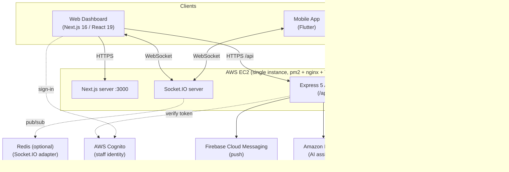

**Deployment.** The backend API and the Next.js server run as two pm2-managed processes on a single
EC2 instance, behind nginx with TLS certificates (Certbot) for both the API domain and the dashboard
domain. A GitHub Actions workflow type-checks and builds both components, then deploys by pulling the
main branch to the instance, applying Prisma migrations, rebuilding, and restarting the pm2
processes.

## 4.2 Technology-Choice Justification

| Decision | Choice | Justification (mapped to NFRs) |
|----------|--------|--------------------------------|
| Backend language/runtime | TypeScript on Node.js | Single language across server and web clients; static typing improves maintainability and reliability. |
| Web framework | Express 5 | Minimal, mature, and flexible; suits a modular monolith with custom middleware (auth, tenant scope, RBAC). |
| ORM / database | Prisma 6 over PostgreSQL | Type-safe data access, declarative schema, and versioned migrations support maintainability and reliability; PostgreSQL provides relational integrity for a richly connected model. |
| Staff identity | AWS Cognito | Offloads secure password storage, verification, and recovery to a managed service (security). |
| Mobile identity | Backend JWT + device sessions | Lightweight, stateless tokens with server-side revocation for mobile, where Cognito is unnecessary (performance, security). |
| Web client | Next.js 16 / React 19 | App-Router structure, server/client rendering, and a large ecosystem (usability, maintainability). |
| Mobile client | Flutter | One codebase for Android and iOS (portability, cost). |
| Real-time | Socket.IO (+ optional Redis adapter) | Room-based broadcasting for per-school isolation, with a clear horizontal-scaling path (scalability). |
| File storage | Amazon S3 (presigned URLs) | Direct client-to-storage uploads offload the API and scale independently (performance, scalability). |
| AI | Amazon Bedrock (Converse + tool use) | Managed access to a capable model with structured tool use, keeping AI within the AWS trust boundary (security). |
| Push | Firebase Cloud Messaging | De-facto standard for mobile push; optional and gracefully degradable (reliability). |

## 4.3 Database Design

The database is the heart of the system. It comprises roughly forty-five entities and twenty-four
enumerations. All primary keys are UUID strings; monetary values use `Decimal(12,2)`; and almost
every entity carries a `schoolId` foreign key enforcing multi-tenancy. The complete data dictionary
appears in Appendix E; this section presents the entity–relationship diagram and a dictionary of the
key entities.

### Figure 4.2 — Database Entity–Relationship Diagram (ERD)

```mermaid
erDiagram
    School ||--o{ User : "has"
    School ||--o{ AcademicYear : "defines"
    School ||--o{ Grade : "defines"
    School ||--o{ SchoolClass : "offers"
    School ||--o{ Subject : "offers"
    School ||--o{ Student : "enrolls"
    School ||--o{ Teacher : "employs"
    School ||--o{ Parent : "registers"
    School ||--o{ AppCredential : "issues"
    School ||--|| SchoolSettings : "configured by"

    User ||--o| Student : "profile"
    User ||--o| Teacher : "profile"
    User ||--o| Parent : "profile"
    User ||--o| Driver : "profile"
    User ||--o| BusSupervisor : "profile"
    AppCredential ||--o{ DeviceSession : "active logins"

    Grade ||--o{ SchoolClass : "groups"
    AcademicYear ||--o{ SchoolClass : "scopes"
    SchoolClass ||--o{ Student : "contains"
    Teacher ||--o{ TeacherSubject : "assigned"
    Subject ||--o{ TeacherSubject : "in"
    SchoolClass ||--o{ TeacherSubject : "for"
    SchoolClass ||--o{ Timetable : "scheduled"

    Application ||--o| ApplicationFather : "has"
    Application ||--o| ApplicationMother : "has"
    Application ||--o| ApplicationGuardian : "has"
    Application ||--o| ApplicationResidence : "has"
    Application ||--o| ApplicationInterview : "has"
    Application ||--o{ ApplicationDocument : "has"
    Application ||--o{ ApplicationFee : "has"
    Application ||--o{ ApplicationStatusLog : "logs"
    Application ||--o| Student : "converts to"

    Parent ||--o{ Student : "father/mother/guardian"
    Student ||--o{ Attendance : "records"
    Student ||--o{ Invoice : "billed"
    Invoice ||--o{ Payment : "settled by"
    Student ||--o{ Payment : "makes"
    Student ||--o{ ExamResult : "achieves"
    Exam ||--o{ ExamResult : "produces"
    Student ||--o{ HomeworkSubmission : "submits"
    Homework ||--o{ HomeworkSubmission : "receives"
    FeeStructure }o--|| School : "scoped"

    Bus ||--o| Driver : "driven by"
    Bus ||--o| BusSupervisor : "supervised by"
    Bus ||--o{ BusRoute : "runs"
    Bus ||--o{ StudentBus : "carries"
    Student ||--o| StudentBus : "assigned"
    Bus ||--o{ BusAttendance : "logs"
    Student ||--o{ BusAttendance : "boarded"

    Student ||--o{ StudentGameProgress : "progresses"
    Teacher ||--o{ BehaviorReport : "writes"
    Student ||--o{ BehaviorReport : "about"
    Teacher ||--o{ DailyReport : "writes"
    Teacher ||--o{ StudentTask : "assigns"
    StudentTask ||--o{ StudentTaskCompletion : "completed"

    School ||--o{ Announcement : "publishes"
    School ||--o{ Notification : "sends"
    Conversation ||--o{ Message : "contains"
    School ||--o{ AiChatMessage : "logs"
```

### Table 4.1 — Data Dictionary (Key Entities)

**School** — the tenant root.

| Field | Type | Notes |
|-------|------|-------|
| id | UUID | PK |
| code | String | Unique school code |
| name | String | Unique |
| email, phone, address | String? | Contact |
| logo, stamp | String? | Branding URLs |
| createdAt / updatedAt | DateTime | Timestamps |

**User** — Cognito-backed identity (web).

| Field | Type | Notes |
|-------|------|-------|
| id | UUID | PK |
| email | String | Unique |
| fullName | String | |
| role | Role (enum) | Default STUDENT |
| schoolId | UUID? | FK → School (null for Super Admin) |

**AppCredential** — mobile login record.

| Field | Type | Notes |
|-------|------|-------|
| id | UUID | PK |
| loginId | String | Unique login ID |
| loginEmail | String? | Optional unique email |
| passwordHash | String | SHA-256 hash |
| plainTextPw | String? | Temporary plaintext for admin sharing |
| role | Role | |
| isActive | Boolean | Account lock flag |
| schoolId | UUID | FK → School |
| studentId/teacherId/parentId/driverId/supervisorId | UUID? | FK to the linked profile |
| googleId, appleId | String? | Social linking |

**Student** — enrolled student.

| Field | Type | Notes |
|-------|------|-------|
| id | UUID | PK |
| userId | UUID | FK → User (unique) |
| schoolId, classId, gradeId, academicYearId | UUID? | FKs |
| nameAr/nameEn, nationalId, dob, gender | mixed | Personal |
| studentCode, rollNumber, enrollmentDate | mixed | Academic |
| status | StudentStatus | ACTIVE … GRADUATED |
| useBus | Boolean | Transport flag |
| points | Int | Gamification |
| fatherId/motherId/guardianId | UUID? | FK → Parent |

**Invoice** — a student bill.

| Field | Type | Notes |
|-------|------|-------|
| id | UUID | PK |
| invoiceNumber | String? | Human-readable |
| schoolId, studentId | UUID | FKs |
| feeType | FeeType | TUITION, BUS, … |
| totalAmount, discount, paid, remaining | Decimal(12,2) | Money |
| dueDate | DateTime? | |
| status | InvoiceStatus | UNPAID/PARTIAL/PAID/OVERDUE/CANCELLED |
| paymentPlan | PaymentPlan | FULL / INSTALLMENTS |

**Payment** — money received against an invoice.

| Field | Type | Notes |
|-------|------|-------|
| id | UUID | PK |
| schoolId, studentId, invoiceId | UUID(?) | FKs |
| amount | Decimal(12,2) | |
| paymentMethod | PaymentMethod? | CASH, BANK_TRANSFER, … |
| receiptNumber | String? | |
| status | PaymentStatus | |
| paidAt | DateTime? | |

**Bus** — a vehicle (carries live GPS).

| Field | Type | Notes |
|-------|------|-------|
| id | UUID | PK |
| schoolId | UUID | FK |
| number, plateNumber, model, year | mixed | Identity |
| capacity | Int | |
| status | BusStatus | ACTIVE/MAINTENANCE/OUT_OF_SERVICE |
| lastLat, lastLng | Float? | Last known location |
| locationUpdatedAt | DateTime? | |

*(Appendix E contains the remaining entities and full field lists.)*

## 4.4 Class / Module Diagram

The backend is organized into feature modules sharing a common core (config, middleware, utilities).
The diagram below abstracts the backend's structure: each feature module exposes routes that invoke a
controller, which uses the Prisma client and shared utilities; cross-cutting middleware guards every
protected route.

### Figure 4.3 — Backend Class / Module Diagram

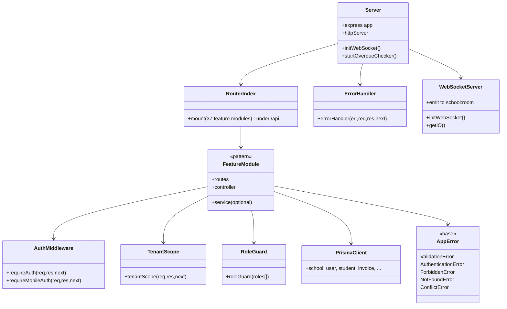

## 4.5 Sequence Diagrams

### Figure 4.4 — Web (Cognito) Login & Synchronization

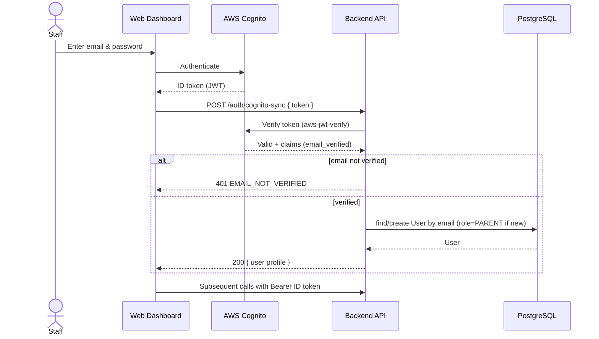

### Figure 4.5 — Mobile Login (JWT + Device Session)

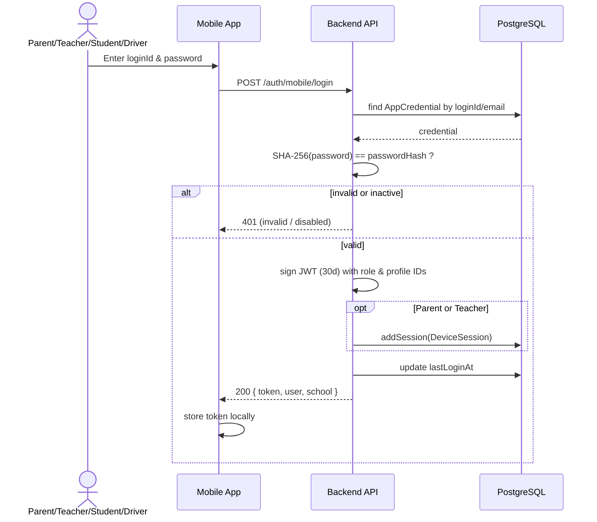

### Figure 4.6 — Mark Attendance

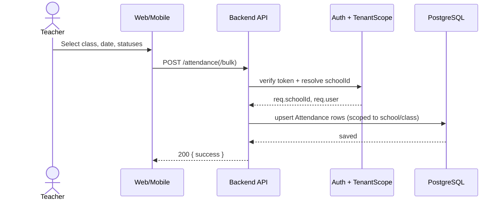

### Figure 4.7 — Issue & Pay Invoice

```mermaid
sequenceDiagram
    actor Accountant
    participant Web as Dashboard
    participant API as Backend API
    participant DB as PostgreSQL
    participant Cron as Overdue Cron

    Accountant->>Web: Create invoice (total, discount, due date)
    Web->>API: POST /invoices
    API->>DB: insert Invoice (status=UNPAID, remaining=total-discount)
    DB-->>API: invoice
    Accountant->>Web: Record payment
    Web->>API: PATCH /invoices/:id/pay { amount }
    API->>DB: insert Payment; update paid/remaining/status
    DB-->>API: updated (PARTIAL or PAID)
    API-->>Web: 200 { invoice }
    Note over Cron,DB: Hourly: mark past-due UNPAID/PARTIAL as OVERDUE
    Cron->>DB: update overdue invoices
```

### Figure 4.8 — Bus GPS Update → Parent Real-Time

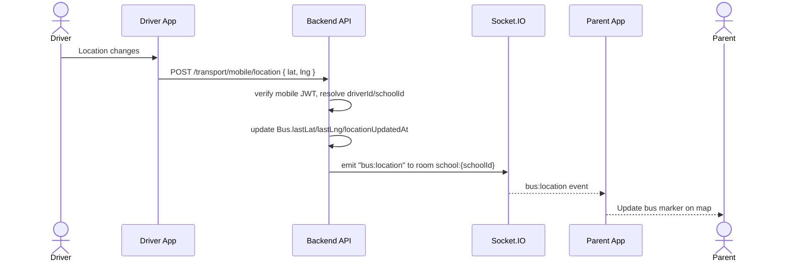

### Figure 4.9 — AI Assistant Tool-Use

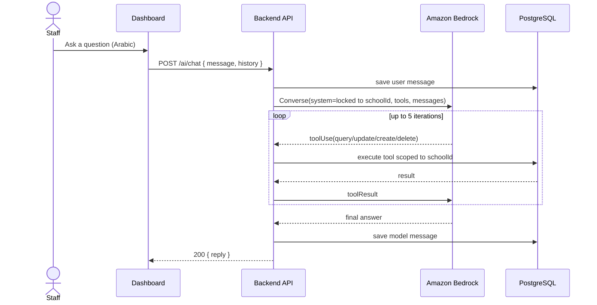

## 4.6 Activity Diagrams

### Figure 4.10 — Admission to Enrollment

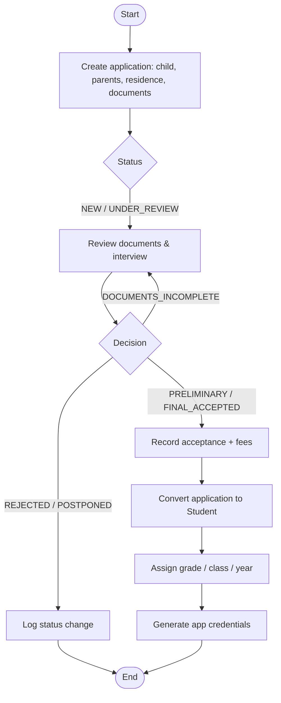

### Figure 4.11 — Invoice Lifecycle

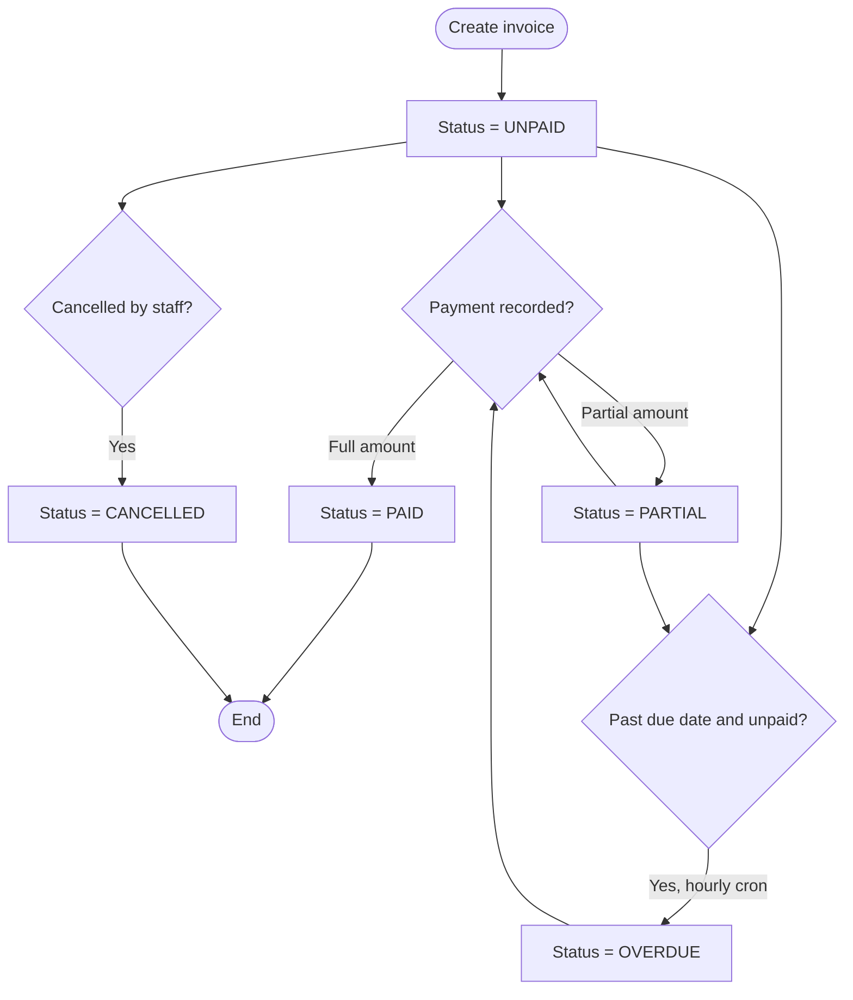

## 4.7 Data-Flow Diagrams

### Figure 4.12 — Context-Level Data-Flow Diagram (Level 0)

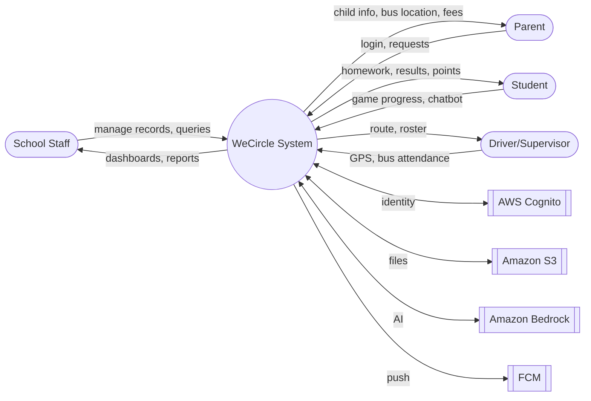

### Figure 4.13 — Level-1 Data-Flow Diagram

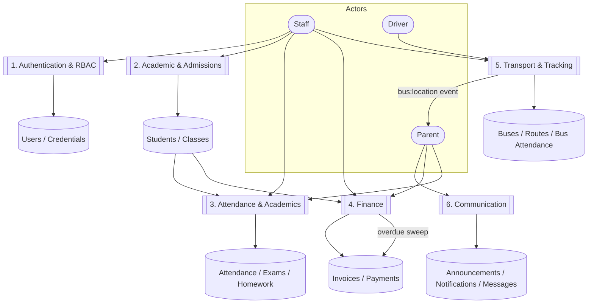

## 4.8 UI/UX Design

### 4.8.1 Design principles

- **Arabic-first, right-to-left.** Interfaces default to Arabic with RTL layout and Egyptian context
  (EGP currency, Sunday–Thursday week), with English supported.
- **Role-tailored experiences.** Each role sees only what it needs: staff use a dense, table- and
  form-oriented dashboard; parents see a focused, child-centric mobile view; students see a playful,
  game-centric interface.
- **Responsiveness.** The web dashboard adapts across screen sizes; the mobile app scales typography
  and spacing to device size (via `flutter_screenutil`).
- **Age-appropriate gamification.** Younger students (grades 1–3) see a "space/galaxy" themed
  experience, and older students (grades 4–6) a "hero/mission" theme, both built around points,
  levels, and learning games to sustain engagement.
- **Consistency and feedback.** A shared component and theming layer (cards, modals, stat cards,
  buttons) provides visual consistency; the backend's uniform response envelope
  (`{ success, message, ... }`) yields consistent success/error feedback in the UI.

### 4.8.2 Representative screens

The following screens are described here and shown as placeholders in Appendix A.

**Web dashboard.** Login (Cognito) → analytics home (KPI cards and charts) → module pages for
students, teachers, parents, classes, attendance, admissions (with a multi-step wizard), payments and
invoices, timetable, exams, homework, transport (buses, drivers, supervisors), announcements,
messages, reports, settings, credentials, and an embedded AI chat assistant.

**Mobile — Parent.** Children dashboard → per-child views: attendance, homework, results, fees/
invoices, schedule, behavior reports, bus tracker (map), messages/chat, profile and device sessions.

**Mobile — Teacher.** Dashboard → classes → attendance, grade entry, daily and behavior reports,
tasks, messages, profile.

**Mobile — Student.** Themed dashboard (by grade band) → learning games, achievements, avatar
selection, homework, results, and an AI study chatbot.

**Mobile — Driver/Supervisor.** Dashboard → route/roster, live location sharing (driver), and
per-student bus attendance.

<div style="page-break-after: always;"></div>
