<!-- ============================================================
     FRONT MATTER
     ============================================================ -->

# WeCircle — School Management System

### Graduation Project Report

---

<div align="center">

**International Academy for Engineering and Media Science (IAEMS)**

**Faculty / Department of Mass Communication**

Bachelor's Degree in Mass Communication
Major in Multimedia and Web / Mobile Application Development

Graduation Project — Senior Year, Spring 2026

---

**Project Title**

**WeCircle: A Multi-Tenant School Management Platform
(REST API Backend · Web Admin Dashboard · Mobile Application)**

---

**Submitted by**

| Team Member | Student ID |
|-------------|------------|
| Maryam Khamis | `[ID: __________]` |
| Karim El-Saeed | `[ID: __________]` |
| Fadi Emad | `[ID: __________]` |
| Adham El-Shater | `[ID: __________]` |
| Jihad Haggag | `[ID: __________]` |
| Sandy Tharwat | `[ID: __________]` |

**Supervised by**

**Dr. Nabil Al-Ghamry**

---

Academic Year 2025–2026 — Spring Semester

</div>

<div style="page-break-after: always;"></div>

---

## Abstract

Schools in Egypt continue to manage admissions, attendance, fee collection, transport, and
parent communication through fragmented manual processes and informal messaging channels. This
fragmentation produces data loss, weak financial oversight, and limited visibility for parents.
**WeCircle** is a multi-tenant school management platform that consolidates these operations into a
single integrated system composed of three components: a REST API backend, a web administration
dashboard, and a cross-platform mobile application.

The backend is implemented in TypeScript on Node.js using the Express 5 web framework and the
Prisma 6 object–relational mapper over a PostgreSQL database. It exposes thirty-seven feature
modules covering authentication and role-based access control, school and academic-structure
management, admissions, students and classes, teachers and assignments, attendance, homework,
examinations and results, timetables, finance (fee structures, invoices, and payments), school-bus
transport with real-time GPS tracking, communication (announcements, notifications, and chat), and
an artificial-intelligence administrative assistant built on Amazon Bedrock. The web dashboard is
built with Next.js 16 and React 19 and authenticates staff through AWS Cognito. The mobile
application is built with Flutter and serves parents, students, teachers, drivers, and bus
supervisors, authenticating through backend-issued JSON Web Tokens derived from application
credentials. The platform enforces tenant isolation by `schoolId` and supports real-time updates
through Socket.IO.

The system was developed using an iterative, incremental methodology with a continuous-integration
gate that type-checks and builds all components on every change. It was evaluated through a manual,
requirement-driven test plan complemented by strict static type-checking. The result is a working,
internally consistent platform that demonstrates a complete school-operations lifecycle—from a
prospective student's admission application to enrollment, daily academic and financial management,
transport tracking, and parent engagement—within a single Arabic-first, multi-tenant architecture.

**Keywords:** school management system; multi-tenant SaaS; REST API; role-based access control;
Flutter; Next.js; Prisma; AWS Cognito; real-time tracking; educational technology.

<div style="page-break-after: always;"></div>

---

## الملخص (Arabic Abstract)

<div dir="rtl">

لا تزال المدارس في مصر تدير عمليات القبول والحضور وتحصيل المصروفات والنقل والتواصل مع أولياء الأمور
من خلال إجراءات يدوية متفرقة وقنوات مراسلة غير رسمية، مما يؤدي إلى فقدان البيانات وضعف الرقابة المالية
ومحدودية متابعة أولياء الأمور لأبنائهم. ومن هنا جاء مشروع **WeCircle**، وهو منصة متعددة المستأجرين
(Multi-Tenant) لإدارة المدارس تجمع هذه العمليات في نظام واحد متكامل يتكوّن من ثلاثة مكوّنات: واجهة
برمجة تطبيقات خلفية (REST API)، ولوحة تحكم إدارية على الويب، وتطبيق محمول يعمل على نظامي أندرويد و iOS.

تم بناء الواجهة الخلفية بلغة TypeScript على بيئة Node.js باستخدام إطار العمل Express وأداة الربط
الكائني Prisma فوق قاعدة بيانات PostgreSQL، وتضم سبعة وثلاثين وحدة وظيفية تشمل المصادقة والتحكم في
الصلاحيات حسب الدور، وإدارة المدرسة والهيكل الأكاديمي، والقبول، والطلاب والفصول، والمعلمين، والحضور،
والواجبات، والامتحانات والنتائج، والجداول الدراسية، والشؤون المالية، والنقل المدرسي مع التتبع اللحظي
لموقع الحافلة، والتواصل، ومساعد ذكاء اصطناعي إداري مبني على خدمة Amazon Bedrock. أما لوحة التحكم فقد
بُنيت باستخدام Next.js و React مع مصادقة الموظفين عبر AWS Cognito، بينما بُني التطبيق المحمول باستخدام
Flutter ليخدم أولياء الأمور والطلاب والمعلمين والسائقين والمشرفين، مع مصادقة قائمة على رموز JWT.

اعتُمد في التطوير منهجٌ تكراري تزايدي مدعوم ببوابة تكامل مستمر تتحقق من سلامة الشيفرة وبنائها عند كل
تعديل، وجرى تقييم النظام عبر خطة اختبار يدوية موجَّهة بالمتطلبات إلى جانب التحقق الثابت الصارم من
الأنواع. والنتيجة منصة عاملة ومتسقة تُغطّي دورة العمل المدرسية كاملة—من تقديم الطالب للالتحاق حتى
التسجيل والإدارة اليومية الأكاديمية والمالية وتتبّع النقل ومتابعة أولياء الأمور—ضمن معمارية واحدة
متعددة المستأجرين تدعم اللغة العربية أولاً.

**الكلمات المفتاحية:** نظام إدارة مدارس؛ منصة متعددة المستأجرين؛ واجهة REST؛ التحكم في الصلاحيات
حسب الدور؛ Flutter؛ Next.js؛ Prisma؛ AWS Cognito؛ التتبع اللحظي؛ تقنيات التعليم.

</div>

<div style="page-break-after: always;"></div>

---

## Acknowledgments

We extend our sincere gratitude to our supervisor, **Dr. Nabil Al-Ghamry**, for his guidance,
constructive feedback, and continuous encouragement throughout the development of this project. We
thank the **International Academy for Engineering and Media Science (IAEMS)** and the **Department
of Mass Communication** for providing the academic environment and resources that made this work
possible.

We are grateful to the teaching staff who shaped our understanding of software engineering,
multimedia, and application development over the course of our studies. Finally, we thank our
families and colleagues for their patience and support during the graduation-project semester.

`[Placeholder: add any additional acknowledgments, e.g., participating school(s) or testers.]`

<div style="page-break-after: always;"></div>

---

## Table of Contents

> The table of contents is generated automatically when the document is assembled and converted
> (see `docs/README.md`). The logical structure is:

1. **Front Matter** — Title Page · Abstract (EN) · الملخص (AR) · Acknowledgments · Lists
2. **Chapter 1 — Introduction**
3. **Chapter 2 — Background & Literature Review**
4. **Chapter 3 — System Analysis**
5. **Chapter 4 — System Design**
6. **Chapter 5 — Implementation**
7. **Chapter 6 — Testing & Evaluation**
8. **Chapter 7 — Conclusion & Future Work**
9. **References**
10. **Appendices** — A: Screenshots · B: Full API Reference · C: User Manual · D: Glossary ·
    E: Database Data Dictionary

<div style="page-break-after: always;"></div>

---

## List of Figures

| Figure | Title | Chapter |
|--------|-------|---------|
| 3.1 | Use-Case Diagram — School Admin / Super Admin | 3 |
| 3.2 | Use-Case Diagram — Teacher | 3 |
| 3.3 | Use-Case Diagram — Parent | 3 |
| 3.4 | Use-Case Diagram — Student | 3 |
| 3.5 | Use-Case Diagram — Driver / Bus Supervisor | 3 |
| 4.1 | System Architecture & Deployment Topology | 4 |
| 4.2 | Database Entity–Relationship Diagram (ERD) | 4 |
| 4.3 | Backend Class / Module Diagram | 4 |
| 4.4 | Sequence Diagram — Web (Cognito) Login & Synchronization | 4 |
| 4.5 | Sequence Diagram — Mobile Login (JWT + Device Session) | 4 |
| 4.6 | Sequence Diagram — Mark Attendance | 4 |
| 4.7 | Sequence Diagram — Issue & Pay Invoice | 4 |
| 4.8 | Sequence Diagram — Bus GPS Update → Parent Real-Time | 4 |
| 4.9 | Sequence Diagram — AI Assistant Tool-Use | 4 |
| 4.10 | Activity Diagram — Admission to Enrollment | 4 |
| 4.11 | Activity Diagram — Invoice Lifecycle | 4 |
| 4.12 | Context-Level Data-Flow Diagram (Level 0) | 4 |
| 4.13 | Level-1 Data-Flow Diagram | 4 |

## List of Tables

| Table | Title | Chapter |
|-------|-------|---------|
| 2.1 | Comparison of Existing School-Management Systems | 2 |
| 3.1 | Functional Requirements Catalogue | 3 |
| 3.2 | Non-Functional Requirements | 3 |
| 4.1 | Data Dictionary — Key Entities | 4 |
| 5.1 | Technology Stack & Versions | 5 |
| 6.1 | Sample Test Cases | 6 |
| 7.1 | Objectives vs. Achievements | 7 |
| B.1 | Full API Endpoint Reference | Appendix B |

<div style="page-break-after: always;"></div>

---

## List of Abbreviations

| Abbreviation | Meaning |
|--------------|---------|
| AI | Artificial Intelligence |
| API | Application Programming Interface |
| AWS | Amazon Web Services |
| CI/CD | Continuous Integration / Continuous Deployment |
| CORS | Cross-Origin Resource Sharing |
| CRUD | Create, Read, Update, Delete |
| DFD | Data-Flow Diagram |
| DM | Direct Message |
| ERD | Entity–Relationship Diagram |
| FCM | Firebase Cloud Messaging |
| GPS | Global Positioning System |
| HTTP(S) | HyperText Transfer Protocol (Secure) |
| IaC | Infrastructure as Code |
| IAM | Identity and Access Management |
| JWT | JSON Web Token |
| ORM | Object–Relational Mapping |
| OAuth | Open Authorization |
| PaaS / SaaS | Platform / Software as a Service |
| RBAC | Role-Based Access Control |
| REST | Representational State Transfer |
| S3 | (Amazon) Simple Storage Service |
| SDK | Software Development Kit |
| SIS / SMS | Student Information System / School Management System |
| SQL | Structured Query Language |
| TLS | Transport Layer Security |
| UAT | User Acceptance Testing |
| UI / UX | User Interface / User Experience |
| UUID | Universally Unique Identifier |
| WS | WebSocket |

<div style="page-break-after: always;"></div>


<!-- ============================================================
     CHAPTER 1 — INTRODUCTION
     ============================================================ -->

# Chapter 1 — Introduction

## 1.1 Overview

A modern school is, in operational terms, a small enterprise. It must process prospective-student
applications, enroll and classify students into grades and classes, schedule lessons, record daily
attendance, set and grade homework and examinations, bill and collect tuition and bus fees, operate
a fleet of school buses, and communicate continuously with parents. In many Egyptian schools these
functions are still handled with a mixture of paper forms, spreadsheets, and informal messaging
applications. Each function is managed in isolation, the same data is re-entered repeatedly, and
parents receive only the information that staff have time to relay manually.

**WeCircle** is a school management platform designed to unify these functions in a single,
integrated, multi-tenant system. The platform is composed of three cooperating components:

1. A **REST API backend** that owns the database and implements all business logic, security, and
   integrations.
2. A **web administration dashboard** used by school staff (administrators, accountants, admissions
   officers, and similar roles).
3. A **cross-platform mobile application** used by parents, students, teachers, bus drivers, and bus
   supervisors.

The term *multi-tenant* means that a single deployment of WeCircle can serve many independent
schools at once. Every record in the system is tagged with the identifier of the school that owns
it (`schoolId`), and the backend enforces that users of one school can never see or modify the data
of another. The platform is **Arabic-first**: its default language, currency (Egyptian Pound), and
working week (Sunday–Thursday) reflect the Egyptian educational context, while remaining
configurable per school.

The system is publicly reachable through its production endpoints—the API at
`https://api.wecircle.helpers-tech.com` and the dashboard at
`https://dashboard.wecircle.helpers-tech.com`—and the mobile application communicates with the same
API.

## 1.2 Problem Statement

The core problem WeCircle addresses can be stated as follows:

> *School operations in the target context are fragmented across disconnected manual tools, which
> causes data duplication and loss, weak financial oversight, slow and inconsistent
> parent communication, and an absence of a single authoritative record of each student's
> administrative, academic, and financial history.*

This general problem decomposes into several concrete pain points:

- **Disconnected data.** Admissions data lives on paper, attendance in a register, fees in a
  spreadsheet, and announcements in a messaging group. There is no single source of truth, so the
  same student is represented inconsistently across systems.
- **Weak financial control.** Without structured invoices, payment records, and overdue tracking,
  schools struggle to know who has paid, who is in arrears, and how much revenue is outstanding.
- **Limited parent visibility.** Parents cannot easily check their child's attendance, homework,
  grades, fees, or the location of the school bus, and instead depend on staff to relay information
  reactively.
- **No role separation.** Manual tools do not enforce who is allowed to see or change what, exposing
  sensitive student and financial data.
- **No real-time information.** Time-critical information—most notably the live position of a school
  bus—cannot be conveyed by manual means.

## 1.3 Motivation

Three factors motivated the development of WeCircle:

1. **A genuine, observed need.** Administrative overhead, fee-collection difficulties, and parent
   communication are widely reported challenges for schools in the region. A system that integrates
   these functions offers tangible operational value.
2. **The opportunity to engineer a complete, real product.** As a graduation project in multimedia
   and web/mobile application development, WeCircle provided an opportunity to design and build a
   full-stack system end to end—database, backend API, web client, and mobile client—rather than an
   isolated prototype, and to deploy it to live cloud infrastructure.
3. **An Arabic-first, context-specific design.** Many capable international systems are not tailored
   to the Egyptian context (Arabic right-to-left interfaces, the Egyptian Pound, the Sunday–Thursday
   week, and locally meaningful admissions documents such as national ID and residence proof).
   WeCircle was motivated by the value of building for this context directly.

## 1.4 Objectives

The project set out to achieve the following objectives. Each is later evaluated against the
delivered system in Chapter 7 (Table 7.1).

- **OBJ-1 — Unified multi-tenant platform.** Build a single backend that securely serves many
  schools, isolating each school's data.
- **OBJ-2 — Authentication and role-based access control.** Provide secure sign-in for staff (web)
  and end users (mobile), and restrict each role to the actions appropriate to it.
- **OBJ-3 — Core academic administration.** Implement management of schools, academic years, grades,
  classes, subjects, students, teachers, and parents.
- **OBJ-4 — Admissions pipeline.** Implement an applications workflow from initial enquiry through
  review, decision, and conversion of an accepted applicant into an enrolled student.
- **OBJ-5 — Attendance, homework, examinations, and timetables.** Implement daily/periodic
  attendance, homework with submissions, examinations with results, and class timetables.
- **OBJ-6 — Financial management.** Implement fee structures, invoices, payments, discounts, and
  automatic overdue detection.
- **OBJ-7 — School-bus transport with live tracking.** Implement buses, routes, driver/supervisor
  management, bus attendance, and real-time GPS tracking visible to parents.
- **OBJ-8 — Communication.** Implement announcements, notifications (with push), and one-to-one
  chat between staff and parents.
- **OBJ-9 — Parent and student mobile experience.** Deliver a mobile application that gives parents
  visibility into their children and gives students an engaging, gamified learning experience.
- **OBJ-10 — AI administrative assistant.** Provide an AI assistant that lets staff query and manage
  their school's data conversationally, scoped strictly to their own school.

## 1.5 Scope & Limitations

### 1.5.1 In scope

The scope of WeCircle is defined by the functionality actually implemented in the codebase: the
thirty-seven backend feature modules and their corresponding web and mobile interfaces, covering
authentication/RBAC, school and academic-structure management, admissions, students, teachers,
parents, attendance, homework, examinations and results, timetables, finance, transport with GPS,
communication, behavior and daily reports, student tasks and gamification, file storage, and the AI
assistant.

### 1.5.2 Limitations and exclusions

In the interest of an honest, defensible account, the following limitations are stated explicitly
and revisited in Chapters 6 and 7:

- **Payment gateway.** The finance module records invoices and payments but does not integrate an
  online payment gateway; payments are recorded by staff.
- **Notification channels.** SMS, WhatsApp, and email channels are modelled in the data layer
  (`SchoolSettings`, `NotificationChannel`) with template fields, but no external provider is wired;
  delivery in the current build is in-app/database, real-time (Socket.IO), and push (FCM, when
  configured).
- **Automated testing.** The project does not include an automated unit/integration test suite;
  quality is enforced through strict static type-checking and a manual, requirement-driven test plan
  (Chapter 6).
- **Security hardening.** Some credentials are stored without best-practice protection (for example,
  mobile passwords are hashed with unsalted SHA-256, and certain secrets are stored in plaintext);
  these are documented as known limitations with remediation proposed in Chapter 7.
- **Infrastructure.** The system is deployed to a single Amazon EC2 instance managed with the pm2
  process manager behind nginx; it is not yet provisioned through infrastructure-as-code and is
  single-region.

## 1.6 Significance

WeCircle is significant on two levels. **Operationally**, it offers a school a single authoritative
record per student spanning admission, academics, finance, transport, and communication; it improves
financial oversight through structured invoicing and overdue detection; and it increases
transparency for parents through a dedicated mobile application that includes real-time bus tracking.
**Academically**, the project demonstrates the end-to-end engineering of a non-trivial,
production-deployed, multi-tenant system across three clients and several cloud services, exercising
database design, API design, authentication and authorization, real-time communication, mobile
development, and applied AI.

## 1.7 Development Methodology

The project followed an **iterative and incremental** development methodology, aligned with Agile
principles and reflected directly in the project's version-control and continuous-integration
history.

- **Incremental delivery.** The system was built and refined module by module, with the application
  kept in a working, buildable state at the end of each increment.
- **Small, reviewable changes.** Work proceeded through small commits with descriptive messages,
  enabling review and traceability.
- **Continuous integration gate.** A GitHub Actions workflow type-checks and builds both the backend
  (`prisma generate` + `tsc`) and the frontend (`next build`) on every push to the main branch
  before deployment, acting as an automated quality gate.
- **Continuous deployment.** On a successful gate, the same workflow deploys the backend and the
  Next.js server to the production host and runs database migrations, so that the live system
  tracks the main branch.
- **Database evolution through migrations.** Schema changes are captured as versioned Prisma
  migrations and applied deterministically in production, preserving a history of the data model.

This methodology suited a small team building a broad system under time constraints: it favored
continuous, verifiable progress over heavyweight up-front specification, while the CI gate and
migration history provided discipline and reproducibility.

## 1.8 Report Organization

The remainder of this report is organized as follows:

- **Chapter 2 — Background & Literature Review** introduces the school-management domain and its key
  technologies, surveys comparable systems in the Egyptian/Arabic market, and performs a gap
  analysis that justifies WeCircle.
- **Chapter 3 — System Analysis** identifies stakeholders, specifies functional and non-functional
  requirements, presents a feasibility study, and models the system's behavior with use-case
  diagrams.
- **Chapter 4 — System Design** presents the system architecture, justifies the technology choices,
  and details the database design (ERD and data dictionary), class diagram, and the sequence,
  activity, and data-flow diagrams for the principal flows, together with the UI/UX design.
- **Chapter 5 — Implementation** describes the development environment, the structure of each
  component, and the concrete implementation of the backend, database, web dashboard, mobile app,
  and security, with annotated code excerpts and a discussion of challenges.
- **Chapter 6 — Testing & Evaluation** presents the testing strategy and levels, a sample
  test-case table, results, and performance notes.
- **Chapter 7 — Conclusion & Future Work** evaluates achievements against objectives and proposes
  enhancements.
- **References** and **Appendices** (screenshots, full API reference, user manual, glossary, and the
  full data dictionary) close the report.

<div style="page-break-after: always;"></div>


<!-- ============================================================
     CHAPTER 2 — BACKGROUND & LITERATURE REVIEW
     ============================================================ -->

# Chapter 2 — Background & Literature Review

## 2.1 Domain Background

A **School Management System (SMS)**—also referred to as a Student Information System (SIS) or
school Enterprise Resource Planning (ERP) system—is software that automates the administrative and
academic operations of an educational institution. Conceptually, an SMS supports the full lifecycle
of a student within a school:

1. **Admission** — a prospective student applies; the school collects the child's and guardians'
   data and supporting documents, reviews the application, and reaches a decision.
2. **Enrollment & classification** — an accepted applicant becomes an enrolled student assigned to a
   grade and class for a given academic year.
3. **Academic operations** — timetabling, attendance, homework, examinations, and results.
4. **Financial operations** — fee structures, invoicing, payment collection, and arrears tracking.
5. **Logistics** — school-bus routes, assignments, and attendance.
6. **Communication** — announcements, notifications, and direct messaging among staff and parents.

A well-designed SMS treats these not as isolated silos but as one connected dataset, so that—for
example—an accepted admission application becomes a student record without re-entry, a student's
class membership drives both attendance and timetable, and a fee structure produces invoices whose
unpaid balances are tracked automatically. WeCircle is designed around exactly this connectedness.

Two characteristics distinguish a modern, cloud-delivered SMS from earlier desktop software:

- **Multi-tenancy.** A single hosted instance serves many schools, each isolated from the others.
  This lowers per-school cost and centralizes maintenance, at the expense of requiring rigorous data
  isolation.
- **Multi-client access.** Staff typically work through a web dashboard, while parents and students
  increasingly expect a mobile application, including push notifications and real-time features such
  as bus tracking.

## 2.2 Key Concepts & Technologies

This section introduces the principal concepts and technologies on which WeCircle is built; their
specific selection is justified in Chapter 4.

- **Client–server architecture and REST APIs.** WeCircle separates a server (the backend, which owns
  the database and business logic) from clients (the web dashboard and mobile app). They communicate
  over HTTP using a **REST** (Representational State Transfer) style: resources such as students,
  invoices, and buses are exposed at URLs and manipulated with the HTTP verbs GET, POST, PUT, PATCH,
  and DELETE, exchanging JSON.

- **Relational databases and ORMs.** Persistent data is stored in **PostgreSQL**, a relational
  database. Rather than writing SQL by hand, the backend uses an **Object–Relational Mapper (ORM)**,
  **Prisma**, which defines the schema declaratively, generates a type-safe client, and manages
  schema evolution through versioned **migrations**.

- **Authentication and authorization.** *Authentication* establishes *who* a user is; *authorization*
  establishes *what* they may do. WeCircle uses **AWS Cognito**—a managed identity service—for staff
  on the web, and **JSON Web Tokens (JWT)** issued by the backend for mobile users. Authorization is
  enforced through **Role-Based Access Control (RBAC)**, in which each user holds a role and access
  is granted to roles rather than individuals.

- **Multi-tenant isolation.** Each record carries a `schoolId`, and middleware guarantees that a
  request can only touch records belonging to the requester's school. This is *logical* isolation
  within a shared database, as opposed to a separate database per tenant.

- **Real-time communication (WebSockets).** Some information, such as a bus's live location, must be
  pushed to clients the moment it changes. WeCircle uses **Socket.IO** (over WebSockets) to broadcast
  events to all users of a given school in real time.

- **Cross-platform mobile development.** The mobile application is built with **Flutter**, a
  framework that compiles a single Dart codebase to both Android and iOS, reducing duplicated effort.

- **Cloud services.** Beyond identity, the platform uses **Amazon S3** for file storage (documents
  and photos, uploaded directly from the client via presigned URLs), **Amazon Bedrock** for the AI
  assistant, and **Firebase Cloud Messaging (FCM)** for mobile push notifications.

- **Applied AI (tool-using assistant).** The AI assistant is built on a large language model accessed
  through Bedrock's *Converse* API with **tool use**: the model is given structured tools to query
  and modify the school's database, and the backend executes those tools on its behalf, strictly
  scoped to the caller's school.

## 2.3 Survey of Existing Systems

To position WeCircle, five existing systems relevant to the Egyptian and wider Arabic market were
reviewed. The descriptions below summarize each system's publicly described purpose and
capabilities; they are intended for comparative positioning, not as endorsements, and feature
availability reflects the systems' marketed capabilities rather than first-hand testing.

1. **Classera** — A MENA-region learning and school-management platform offering a learning
   management system, communication tools, and analytics, used by schools across the Arab world and
   available in Arabic. Its strength is the academic/LMS dimension and regional localization
   [see References, Chapter "References"].

2. **Fedena** — A widely deployed, originally open-source school ERP covering students, attendance,
   examinations, fees, and timetabling. It is commonly adopted by institutions in the Middle East and
   South Asia and is extensible through modules. Its strength is breadth of administrative coverage.

3. **Schoolizer / school-parent communication apps (Egyptian market)** — A class of locally marketed
   applications focused on connecting schools with parents (announcements, grades, attendance,
   payments) and on school discovery. Their strength is parent communication tailored to the local
   market.

4. **ClassDojo** — A globally popular classroom-communication and behavior-management application
   centered on parent engagement and positive-behavior points. It is included here because of its
   strong behavior and parent-engagement model, which is conceptually close to WeCircle's behavior
   reports and gamification, though it is not a full administrative SMS.

5. **Generic Egyptian school ERP / in-house systems** — Many Egyptian schools use bespoke or
   spreadsheet-augmented systems for fees and records. These represent the *status quo* WeCircle aims
   to replace: functional for finance and records, but typically lacking an integrated parent mobile
   app, real-time bus tracking, and unified multi-tenancy.

### Table 2.1 — Comparison of Existing School-Management Systems

| Capability | Classera | Fedena | Egyptian parent apps | ClassDojo | In-house / spreadsheets | **WeCircle** |
|------------|:--------:|:------:|:--------------------:|:---------:|:-----------------------:|:------------:|
| Admissions workflow (application → decision → enrollment) | Partial | Yes | Limited | No | Partial | **Yes** |
| Attendance (daily/periodic) | Yes | Yes | View-only | Partial | Partial | **Yes** |
| Homework & submissions | Yes | Yes | View-only | Partial | Rare | **Yes** |
| Exams & results | Yes | Yes | View-only | No | Partial | **Yes** |
| Fees, invoices & overdue tracking | Partial | Yes | View/pay | No | Yes | **Yes** |
| School-bus management | Limited | Limited | Limited | No | Rare | **Yes** |
| **Real-time bus GPS tracking for parents** | Rare | No | Some | No | No | **Yes** |
| Parent mobile application | Yes | Partial | Yes | Yes | Rare | **Yes** |
| Student gamified experience | Partial | No | No | Yes | No | **Yes** |
| One-to-one staff↔parent chat | Yes | Partial | Some | Messaging | No | **Yes** |
| Arabic-first / RTL & EGP context | Yes | Partial | Yes | Partial | Yes | **Yes** |
| Multi-tenant (many schools, one instance) | Yes | Yes | Yes | Yes | No | **Yes** |
| **Conversational AI admin assistant over school data** | No | No | No | No | No | **Yes** |

> *Legend:* "Yes" = a core, integrated capability; "Partial/Limited" = present but narrow or
> add-on; "View-only/View-pay" = parent-facing visibility without full management; "Rare/No" =
> typically absent. Entries reflect the systems' publicly described capabilities.

## 2.4 Gap Analysis

The survey reveals that the Egyptian/Arabic market is well served in *parts* of the lifecycle but
poorly served in *integration* of the whole:

- **Integration gap.** Established ERPs (e.g., Fedena) cover administration well but treat the parent
  mobile experience and transport tracking as weak or add-on areas. Parent-communication apps cover
  engagement well but are not authoritative systems of record for admissions, academics, and finance.
  Few systems unify *all* of admissions, academics, finance, transport, communication, and an
  engaging student experience in one product.
- **Real-time transport gap.** Real-time, parent-visible **bus GPS tracking** is rare. For parents,
  this is one of the highest-value features, and it is largely missing from the systems reviewed.
- **Student-engagement gap.** Administrative systems treat students as records, not users. WeCircle
  treats younger students as first-class users with a **gamified** mobile experience (points, levels,
  learning games), bridging administration and engagement.
- **Localization-plus-multi-tenancy gap.** While individual systems are either Arabic-localized *or*
  multi-tenant, WeCircle is designed from the ground up to be **both**—Arabic-first defaults
  (language, EGP, Sunday–Thursday week, national-ID and residence-proof admission documents) within a
  strictly isolated multi-tenant backend.
- **Intelligent administration gap.** None of the surveyed systems offer a **conversational AI
  assistant** that lets staff query and update their school's data in natural language, scoped to
  their own tenant. WeCircle's Bedrock-based assistant is a distinguishing capability.

These gaps justify WeCircle's design goal: not to introduce a single new feature, but to **integrate
the full school-operations lifecycle**—including the under-served areas of real-time transport,
student engagement, and intelligent administration—within one Arabic-first, multi-tenant platform
spanning web and mobile.

<div style="page-break-after: always;"></div>


<!-- ============================================================
     CHAPTER 3 — SYSTEM ANALYSIS
     ============================================================ -->

# Chapter 3 — System Analysis

This chapter analyzes *what* WeCircle must do. It identifies the stakeholders, specifies the
functional and non-functional requirements derived from the implemented system, assesses
feasibility, and models the principal interactions as use cases.

## 3.1 Stakeholders & Users

WeCircle defines ten roles (the `Role` enumeration in the data model). Roles map to two access
surfaces: the **web dashboard** (staff) and the **mobile application** (end users). The table below
lists each role, its surface, and its primary goals.

| # | Role | Surface | Primary goals |
|---|------|---------|---------------|
| 1 | **Super Admin** | Web | Operate the platform across all schools; create schools; manage staff, classes, and platform-wide configuration; the only role able to cross tenant boundaries. |
| 2 | **School Admin** | Web | Run a single school day-to-day; manage students, staff, and academic structure; the principal administrative role. |
| 3 | **Admission Officer** | Web | Process admission applications from enquiry to decision and conversion to a student. |
| 4 | **Student Affairs** | Web | Maintain student records, leave requests, and behavior follow-up. |
| 5 | **Accountant** | Web | Manage fee structures, issue invoices, and record payments. |
| 6 | **Teacher** | Web + Mobile | Mark attendance, set homework, enter exam results, write behavior and daily reports, assign tasks, and communicate with parents. |
| 7 | **Parent** | Mobile (default web role) | Follow each child's attendance, homework, results, fees, schedule, behavior, and bus location; communicate with staff. |
| 8 | **Student** | Mobile | Access a gamified learning experience, view results and homework, and use the student AI chatbot. |
| 9 | **Driver** | Mobile | View the assigned route, push live GPS location, and record bus attendance. |
| 10 | **Bus Supervisor** | Mobile | Record per-student bus boarding/absence and manage the supervised bus. |

Secondary stakeholders include **the school as an institution** (the tenant that owns the data) and
**the development/operations team** that maintains the platform.

## 3.2 Functional Requirements

Functional requirements are grouped by module and numbered `FR-<module>-<n>`. They are derived
directly from the implemented backend endpoints and clients (see Appendix B for the full endpoint
catalogue).

### Table 3.1 — Functional Requirements Catalogue

**Authentication & Access Control (AUTH)**
- **FR-AUTH-1** Staff shall authenticate to the web dashboard via AWS Cognito; the backend shall
  verify the identity token and synchronize a local user record only if the email is verified.
- **FR-AUTH-2** End users shall authenticate to the mobile app with a login ID/email and password,
  receiving a signed JWT valid for 30 days.
- **FR-AUTH-3** The system shall support social sign-in (Google/Apple) for mobile credentials that
  have been linked.
- **FR-AUTH-4** The system shall enforce role-based access control on protected operations.
- **FR-AUTH-5** The system shall isolate all data by school (tenant) and prevent cross-tenant access,
  except for the Super Admin.
- **FR-AUTH-6** Parents and teachers shall be able to view active device sessions and remotely log
  out individual or all other devices; changing a password shall revoke existing sessions.

**School, Academic Structure & Settings (CORE)**
- **FR-CORE-1** A Super Admin shall create and configure schools (code, name, branding, contact).
- **FR-CORE-2** Staff shall manage academic years, grades, subjects, and classes for their school.
- **FR-CORE-3** Staff shall configure school settings (language, currency, timezone, working days,
  periods per day, attendance mode, notification toggles, and integration credentials).
- **FR-CORE-4** The system shall provide an administrative dashboard overview and aggregated reports.

**Admissions (ADM)**
- **FR-ADM-1** Staff shall create an admission application capturing child, father, mother, guardian,
  and residence data, with supporting documents.
- **FR-ADM-2** Staff shall track each application through a defined status workflow, recording status
  changes and contact logs.
- **FR-ADM-3** Staff shall view admission statistics (funnel by status).
- **FR-ADM-4** Upon final acceptance, staff shall convert an application into an enrolled student
  without re-entering data.

**Students, Teachers & Parents (PPL)**
- **FR-PPL-1** Staff (School Admin/Super Admin) shall create, update, and delete student records.
- **FR-PPL-2** A Super Admin shall create, update, and delete teacher records and manage
  teacher↔subject↔class assignments.
- **FR-PPL-3** Staff shall manage parents and attach parents (father/mother/guardian) to students.
- **FR-PPL-4** Staff shall generate, bulk-generate, reset, enable/disable, and delete mobile login
  credentials for students, parents, teachers, drivers, and supervisors.

**Attendance (ATT)**
- **FR-ATT-1** Teachers/staff shall record student attendance in daily or periodic mode, individually
  or in bulk, with status (present, absent, late, excused, emergency).
- **FR-ATT-2** The system shall record teacher/staff attendance.
- **FR-ATT-3** Teachers shall mark attendance from the mobile app.

**Homework, Exams & Timetable (ACAD)**
- **FR-ACAD-1** Teachers shall create homework with due dates and attachments and review submissions.
- **FR-ACAD-2** Students/parents shall view assigned homework on mobile.
- **FR-ACAD-3** Teachers/staff shall create exams, enter and approve results, and lock results.
- **FR-ACAD-4** Students/parents shall view results on mobile.
- **FR-ACAD-5** Staff shall manage class timetables (including auto-generation); students and
  teachers shall view their schedules on mobile.

**Finance (FIN)**
- **FR-FIN-1** Staff shall define fee structures per grade, year, or student.
- **FR-FIN-2** Staff shall create invoices (individually or in bulk) with totals, discounts, due
  dates, and payment plans.
- **FR-FIN-3** Staff shall record payments against invoices, apply discounts, adjust deadlines, and
  toggle a student's access in relation to dues.
- **FR-FIN-4** The system shall automatically detect and mark overdue invoices on a schedule.
- **FR-FIN-5** Parents shall view their children's invoices on mobile.

**Transport (TRN)**
- **FR-TRN-1** Staff shall manage buses, routes, drivers, and supervisors, and assign students to
  buses.
- **FR-TRN-2** Drivers shall push the bus's live GPS location, which shall be broadcast in real time
  to the school's users.
- **FR-TRN-3** Parents shall view their child's assigned bus and its last known location on mobile.
- **FR-TRN-4** Supervisors/drivers shall record per-student bus attendance (boarded/absent/excused).

**Communication (COMM)**
- **FR-COMM-1** Staff (Super Admin/Teacher) shall publish announcements with audience targeting and
  expiry.
- **FR-COMM-2** The system shall deliver notifications in-app and via real-time and push channels,
  and allow registering/unregistering device push tokens.
- **FR-COMM-3** Staff and parents shall hold one-to-one conversations (chat) on web and mobile.

**Behavior, Reports, Tasks & Gamification (ENG)**
- **FR-ENG-1** Teachers shall create behavior reports (positive/negative/follow-up) visible to
  parents.
- **FR-ENG-2** Teachers shall create daily class reports (interaction, attention, participation).
- **FR-ENG-3** Teachers shall assign student tasks with reward points and mark completion.
- **FR-ENG-4** Students shall accumulate points and per-game progress (levels) persisted on the
  server.

**AI Assistant (AI)**
- **FR-AI-1** Staff shall converse with an AI assistant that can query, create, update, and delete
  their school's data, scoped strictly to their own school.
- **FR-AI-2** The system shall persist AI chat history grouped into sessions and allow deletion.
- **FR-AI-3** Access to the assistant may be gated by a per-school AI password.
- **FR-AI-4** Students shall access a separate mobile AI chatbot.

**Storage & Records (SYS)**
- **FR-SYS-1** Authenticated users shall upload files (documents, photos) directly to object storage
  via presigned URLs.
- **FR-SYS-2** The system shall log significant actions and support archiving and restoring deleted
  entities.

## 3.3 Non-Functional Requirements

### Table 3.2 — Non-Functional Requirements

| Category | Requirement |
|----------|-------------|
| **Security** | All traffic over HTTPS/TLS; tokens verified cryptographically; RBAC and tenant isolation enforced server-side; security headers (Helmet) and a CORS allow-list; request body size capped; verified-email requirement on staff sign-in; revocable mobile sessions. |
| **Performance** | Indexed database access on high-traffic columns (`schoolId`, foreign keys, date ranges); direct client-to-S3 uploads to offload the API; real-time events scoped to per-school rooms to limit fan-out. |
| **Scalability** | Stateless JWT auth and an optional Socket.IO Redis adapter enabling horizontal scaling beyond one instance; multi-tenant design serving many schools from one deployment. |
| **Usability** | Arabic-first, right-to-left interface with English support; responsive web dashboard; role-tailored mobile experiences; age-appropriate gamified UI for younger students. |
| **Reliability / Availability** | Continuous-integration build gate before deploy; deterministic database migrations; graceful degradation (push and real-time are optional; the system functions without them). |
| **Maintainability** | Modular backend (feature modules: routes → controller → service), centralized error handling and validation, type-safe code under TypeScript strict mode, and versioned schema migrations. |
| **Portability** | Single Flutter codebase targeting Android and iOS; environment-driven configuration for all components. |

## 3.4 Feasibility Study

**Technical feasibility.** The system is built on mature, widely adopted technologies (Node.js,
PostgreSQL, Next.js, React, Flutter, and AWS managed services). All three components build and
type-check cleanly, and the system is deployed and reachable in production, confirming technical
feasibility. The principal technical risks—multi-tenant data isolation, reconciling two
authentication systems, and real-time delivery at scale—are addressed respectively by tenant-scoping
middleware, a layered authentication design, and an optional Redis adapter for Socket.IO.

**Operational feasibility.** The role model maps directly onto the real organizational structure of
a school (administration, admissions, accounts, teaching, transport, and parents), so the software
fits existing workflows rather than forcing new ones. The Arabic-first design and familiar concepts
(grades, classes, invoices, bus routes) lower the adoption barrier for staff and parents.

**Economic feasibility.** The multi-tenant architecture allows one deployment to serve many schools,
amortizing infrastructure cost. The current deployment runs on a single cloud instance with managed
services billed on usage (identity, storage, AI, push), keeping fixed costs low for a pilot while
leaving a clear path to scale. Development relied on open-source frameworks, incurring no licensing
cost.

## 3.5 Use-Case Diagrams

The following use-case diagrams model each primary role's interactions with the system. (Mermaid
renders use cases as rounded nodes connected to the actor.)

### Figure 3.1 — Use-Case Diagram: School Admin / Super Admin

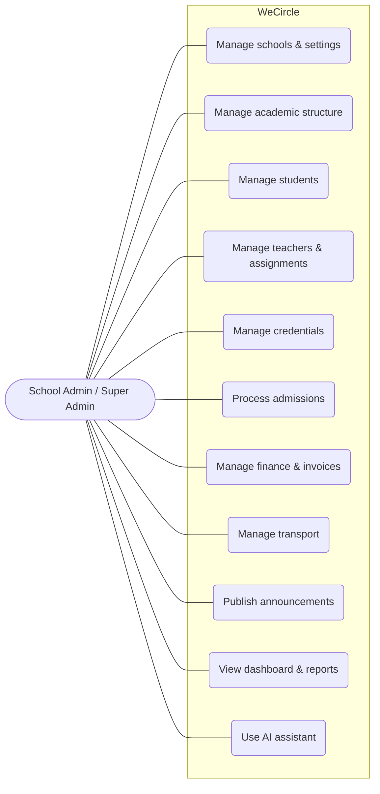

### Figure 3.2 — Use-Case Diagram: Teacher

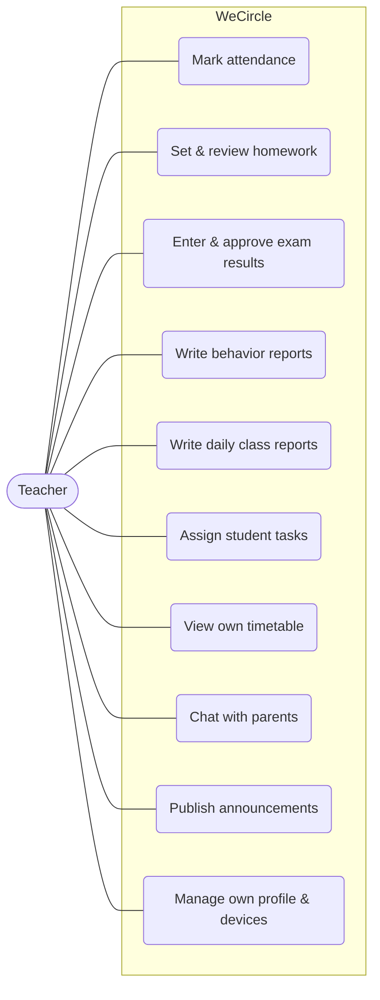

### Figure 3.3 — Use-Case Diagram: Parent

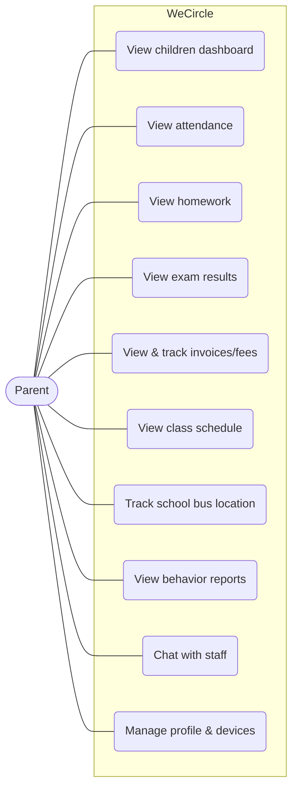

### Figure 3.4 — Use-Case Diagram: Student

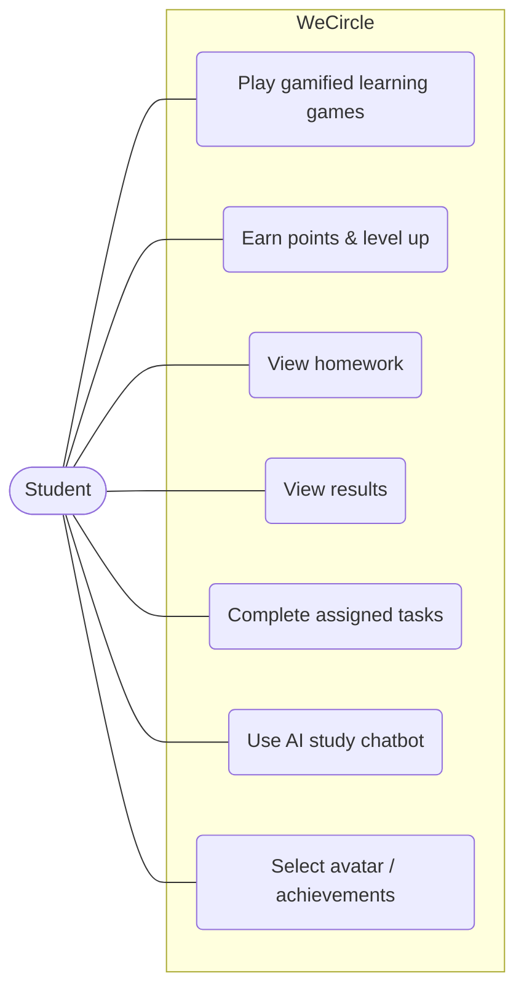

### Figure 3.5 — Use-Case Diagram: Driver / Bus Supervisor

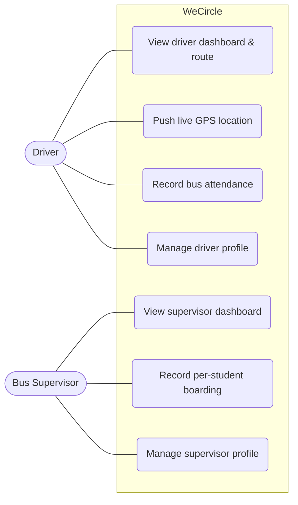

### 3.5.1 Key Use-Case Descriptions

The following structured descriptions detail five representative scenarios.

**UC-1: Onboard a student and issue mobile credentials**
- *Actor:* School Admin.
- *Precondition:* The admin is authenticated and scoped to a school; the relevant grade/class exists.
- *Main flow:* (1) Admin creates a student (or converts an accepted admission application).
  (2) Admin attaches the parent(s). (3) Admin generates app credentials for the student and parent.
  (4) The system stores the credential with a hashed password and a temporary plaintext copy for the
  admin to share. (5) The parent signs in to the mobile app with the credential.
- *Postcondition:* The student exists and is reachable by an authenticated parent on mobile.

**UC-2: Mark daily attendance**
- *Actor:* Teacher.
- *Precondition:* The teacher is authenticated (web or mobile) and assigned to the class.
- *Main flow:* (1) Teacher selects the class and date. (2) Teacher marks each student's status (or
  bulk-marks). (3) The system persists attendance scoped to the school and class. (4) Absences may
  trigger notifications.
- *Postcondition:* Attendance is recorded and visible to parents.

**UC-3: Issue and collect an invoice**
- *Actor:* Accountant / School Admin.
- *Precondition:* A fee structure or amount is known for the student.
- *Main flow:* (1) Staff create an invoice (or bulk invoices) with total, discount, and due date.
  (2) A parent pays at the school. (3) Staff record the payment against the invoice. (4) The system
  updates paid/remaining amounts and the invoice status (UNPAID → PARTIAL → PAID). (5) A scheduled
  job marks unpaid past-due invoices as OVERDUE.
- *Postcondition:* The invoice reflects the true balance; arrears are tracked automatically.

**UC-4: Track the school bus in real time**
- *Actors:* Driver (producer), Parent (consumer).
- *Precondition:* The student is assigned to a bus; the driver is authenticated on mobile.
- *Main flow:* (1) The driver's app periodically posts GPS coordinates. (2) The backend stores the
  latest location on the bus and broadcasts a `bus:location` event to the school's real-time room.
  (3) The parent's app, subscribed to the school room, updates the bus position on a map.
- *Postcondition:* Parents see the bus's near-live location.

**UC-5: Query school data with the AI assistant**
- *Actor:* School staff.
- *Precondition:* The staff member is authenticated; the AI password gate (if set) is satisfied.
- *Main flow:* (1) Staff type a natural-language request. (2) The backend sends the conversation to
  Amazon Bedrock with database tools and a system prompt locking the assistant to the caller's
  `schoolId`. (3) The model calls tools; the backend executes them against Prisma (scoped to the
  school) and returns results. (4) The model composes an Arabic answer; the exchange is saved to
  history.
- *Postcondition:* Staff receive an answer (and any requested change) limited to their own school.

<div style="page-break-after: always;"></div>


<!-- ============================================================
     CHAPTER 4 — SYSTEM DESIGN
     ============================================================ -->

# Chapter 4 — System Design

This chapter describes *how* WeCircle is structured to satisfy the requirements of Chapter 3. It
presents the overall architecture and deployment, justifies the technology choices, details the
database design, and models the system with class, sequence, activity, and data-flow diagrams,
closing with the UI/UX design.

## 4.1 System Architecture

WeCircle follows a **client–server, multi-tier architecture** in which a single backend owns the
database and all business logic, and two thin clients consume it over HTTPS. The backend is a
**modular monolith**: one deployable Express application internally organized into independent
feature modules. Real-time updates flow over a Socket.IO (WebSocket) channel, and several
responsibilities are delegated to managed cloud services.

The principal elements are:

- **Clients:** the Next.js web dashboard (staff) and the Flutter mobile app (parents, students,
  teachers, drivers, supervisors).
- **Backend:** an Express 5 / TypeScript application with a middleware pipeline
  (authentication → tenant scoping → role guard → controller), 37 feature modules, a Socket.IO
  server, and a scheduled job for overdue invoices.
- **Data store:** PostgreSQL accessed through the Prisma ORM.
- **Managed services:** AWS Cognito (staff identity), Amazon S3 (file storage), Amazon Bedrock (AI),
  Firebase Cloud Messaging (push), and an optional Redis instance (Socket.IO scaling).

### Figure 4.1 — System Architecture & Deployment Topology

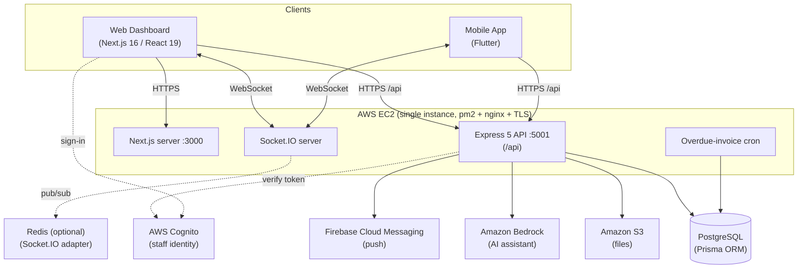

**Deployment.** The backend API and the Next.js server run as two pm2-managed processes on a single
EC2 instance, behind nginx with TLS certificates (Certbot) for both the API domain and the dashboard
domain. A GitHub Actions workflow type-checks and builds both components, then deploys by pulling the
main branch to the instance, applying Prisma migrations, rebuilding, and restarting the pm2
processes.

## 4.2 Technology-Choice Justification

| Decision | Choice | Justification (mapped to NFRs) |
|----------|--------|--------------------------------|
| Backend language/runtime | TypeScript on Node.js | Single language across server and web clients; static typing improves maintainability and reliability. |
| Web framework | Express 5 | Minimal, mature, and flexible; suits a modular monolith with custom middleware (auth, tenant scope, RBAC). |
| ORM / database | Prisma 6 over PostgreSQL | Type-safe data access, declarative schema, and versioned migrations support maintainability and reliability; PostgreSQL provides relational integrity for a richly connected model. |
| Staff identity | AWS Cognito | Offloads secure password storage, verification, and recovery to a managed service (security). |
| Mobile identity | Backend JWT + device sessions | Lightweight, stateless tokens with server-side revocation for mobile, where Cognito is unnecessary (performance, security). |
| Web client | Next.js 16 / React 19 | App-Router structure, server/client rendering, and a large ecosystem (usability, maintainability). |
| Mobile client | Flutter | One codebase for Android and iOS (portability, cost). |
| Real-time | Socket.IO (+ optional Redis adapter) | Room-based broadcasting for per-school isolation, with a clear horizontal-scaling path (scalability). |
| File storage | Amazon S3 (presigned URLs) | Direct client-to-storage uploads offload the API and scale independently (performance, scalability). |
| AI | Amazon Bedrock (Converse + tool use) | Managed access to a capable model with structured tool use, keeping AI within the AWS trust boundary (security). |
| Push | Firebase Cloud Messaging | De-facto standard for mobile push; optional and gracefully degradable (reliability). |

## 4.3 Database Design

The database is the heart of the system. It comprises roughly forty-five entities and twenty-four
enumerations. All primary keys are UUID strings; monetary values use `Decimal(12,2)`; and almost
every entity carries a `schoolId` foreign key enforcing multi-tenancy. The complete data dictionary
appears in Appendix E; this section presents the entity–relationship diagram and a dictionary of the
key entities.

### Figure 4.2 — Database Entity–Relationship Diagram (ERD)

```mermaid
erDiagram
    School ||--o{ User : "has"
    School ||--o{ AcademicYear : "defines"
    School ||--o{ Grade : "defines"
    School ||--o{ SchoolClass : "offers"
    School ||--o{ Subject : "offers"
    School ||--o{ Student : "enrolls"
    School ||--o{ Teacher : "employs"
    School ||--o{ Parent : "registers"
    School ||--o{ AppCredential : "issues"
    School ||--|| SchoolSettings : "configured by"

    User ||--o| Student : "profile"
    User ||--o| Teacher : "profile"
    User ||--o| Parent : "profile"
    User ||--o| Driver : "profile"
    User ||--o| BusSupervisor : "profile"
    AppCredential ||--o{ DeviceSession : "active logins"

    Grade ||--o{ SchoolClass : "groups"
    AcademicYear ||--o{ SchoolClass : "scopes"
    SchoolClass ||--o{ Student : "contains"
    Teacher ||--o{ TeacherSubject : "assigned"
    Subject ||--o{ TeacherSubject : "in"
    SchoolClass ||--o{ TeacherSubject : "for"
    SchoolClass ||--o{ Timetable : "scheduled"

    Application ||--o| ApplicationFather : "has"
    Application ||--o| ApplicationMother : "has"
    Application ||--o| ApplicationGuardian : "has"
    Application ||--o| ApplicationResidence : "has"
    Application ||--o| ApplicationInterview : "has"
    Application ||--o{ ApplicationDocument : "has"
    Application ||--o{ ApplicationFee : "has"
    Application ||--o{ ApplicationStatusLog : "logs"
    Application ||--o| Student : "converts to"

    Parent ||--o{ Student : "father/mother/guardian"
    Student ||--o{ Attendance : "records"
    Student ||--o{ Invoice : "billed"
    Invoice ||--o{ Payment : "settled by"
    Student ||--o{ Payment : "makes"
    Student ||--o{ ExamResult : "achieves"
    Exam ||--o{ ExamResult : "produces"
    Student ||--o{ HomeworkSubmission : "submits"
    Homework ||--o{ HomeworkSubmission : "receives"
    FeeStructure }o--|| School : "scoped"

    Bus ||--o| Driver : "driven by"
    Bus ||--o| BusSupervisor : "supervised by"
    Bus ||--o{ BusRoute : "runs"
    Bus ||--o{ StudentBus : "carries"
    Student ||--o| StudentBus : "assigned"
    Bus ||--o{ BusAttendance : "logs"
    Student ||--o{ BusAttendance : "boarded"

    Student ||--o{ StudentGameProgress : "progresses"
    Teacher ||--o{ BehaviorReport : "writes"
    Student ||--o{ BehaviorReport : "about"
    Teacher ||--o{ DailyReport : "writes"
    Teacher ||--o{ StudentTask : "assigns"
    StudentTask ||--o{ StudentTaskCompletion : "completed"

    School ||--o{ Announcement : "publishes"
    School ||--o{ Notification : "sends"
    Conversation ||--o{ Message : "contains"
    School ||--o{ AiChatMessage : "logs"
```

### Table 4.1 — Data Dictionary (Key Entities)

**School** — the tenant root.

| Field | Type | Notes |
|-------|------|-------|
| id | UUID | PK |
| code | String | Unique school code |
| name | String | Unique |
| email, phone, address | String? | Contact |
| logo, stamp | String? | Branding URLs |
| createdAt / updatedAt | DateTime | Timestamps |

**User** — Cognito-backed identity (web).

| Field | Type | Notes |
|-------|------|-------|
| id | UUID | PK |
| email | String | Unique |
| fullName | String | |
| role | Role (enum) | Default STUDENT |
| schoolId | UUID? | FK → School (null for Super Admin) |

**AppCredential** — mobile login record.

| Field | Type | Notes |
|-------|------|-------|
| id | UUID | PK |
| loginId | String | Unique login ID |
| loginEmail | String? | Optional unique email |
| passwordHash | String | SHA-256 hash |
| plainTextPw | String? | Temporary plaintext for admin sharing |
| role | Role | |
| isActive | Boolean | Account lock flag |
| schoolId | UUID | FK → School |
| studentId/teacherId/parentId/driverId/supervisorId | UUID? | FK to the linked profile |
| googleId, appleId | String? | Social linking |

**Student** — enrolled student.

| Field | Type | Notes |
|-------|------|-------|
| id | UUID | PK |
| userId | UUID | FK → User (unique) |
| schoolId, classId, gradeId, academicYearId | UUID? | FKs |
| nameAr/nameEn, nationalId, dob, gender | mixed | Personal |
| studentCode, rollNumber, enrollmentDate | mixed | Academic |
| status | StudentStatus | ACTIVE … GRADUATED |
| useBus | Boolean | Transport flag |
| points | Int | Gamification |
| fatherId/motherId/guardianId | UUID? | FK → Parent |

**Invoice** — a student bill.

| Field | Type | Notes |
|-------|------|-------|
| id | UUID | PK |
| invoiceNumber | String? | Human-readable |
| schoolId, studentId | UUID | FKs |
| feeType | FeeType | TUITION, BUS, … |
| totalAmount, discount, paid, remaining | Decimal(12,2) | Money |
| dueDate | DateTime? | |
| status | InvoiceStatus | UNPAID/PARTIAL/PAID/OVERDUE/CANCELLED |
| paymentPlan | PaymentPlan | FULL / INSTALLMENTS |

**Payment** — money received against an invoice.

| Field | Type | Notes |
|-------|------|-------|
| id | UUID | PK |
| schoolId, studentId, invoiceId | UUID(?) | FKs |
| amount | Decimal(12,2) | |
| paymentMethod | PaymentMethod? | CASH, BANK_TRANSFER, … |
| receiptNumber | String? | |
| status | PaymentStatus | |
| paidAt | DateTime? | |

**Bus** — a vehicle (carries live GPS).

| Field | Type | Notes |
|-------|------|-------|
| id | UUID | PK |
| schoolId | UUID | FK |
| number, plateNumber, model, year | mixed | Identity |
| capacity | Int | |
| status | BusStatus | ACTIVE/MAINTENANCE/OUT_OF_SERVICE |
| lastLat, lastLng | Float? | Last known location |
| locationUpdatedAt | DateTime? | |

*(Appendix E contains the remaining entities and full field lists.)*

## 4.4 Class / Module Diagram

The backend is organized into feature modules sharing a common core (config, middleware, utilities).
The diagram below abstracts the backend's structure: each feature module exposes routes that invoke a
controller, which uses the Prisma client and shared utilities; cross-cutting middleware guards every
protected route.

### Figure 4.3 — Backend Class / Module Diagram

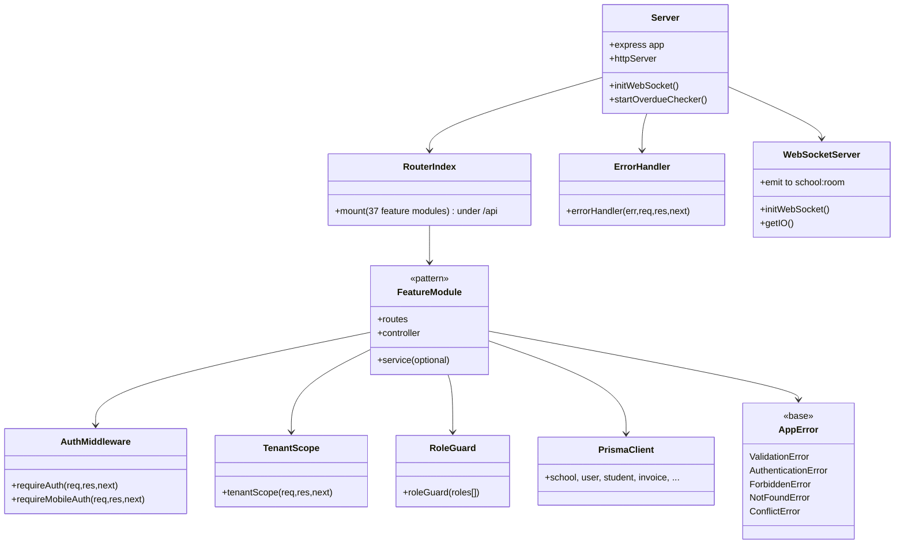

## 4.5 Sequence Diagrams

### Figure 4.4 — Web (Cognito) Login & Synchronization

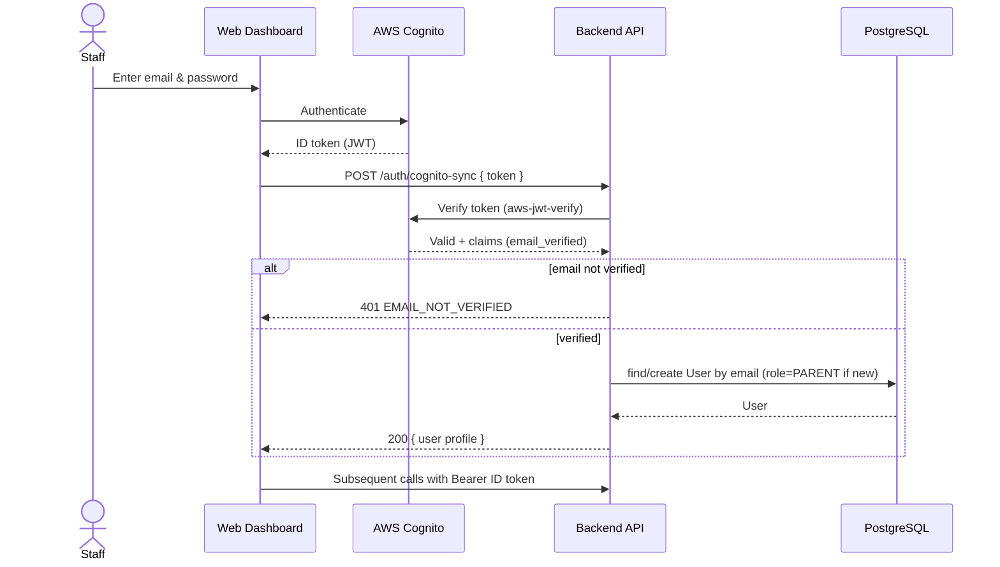

### Figure 4.5 — Mobile Login (JWT + Device Session)

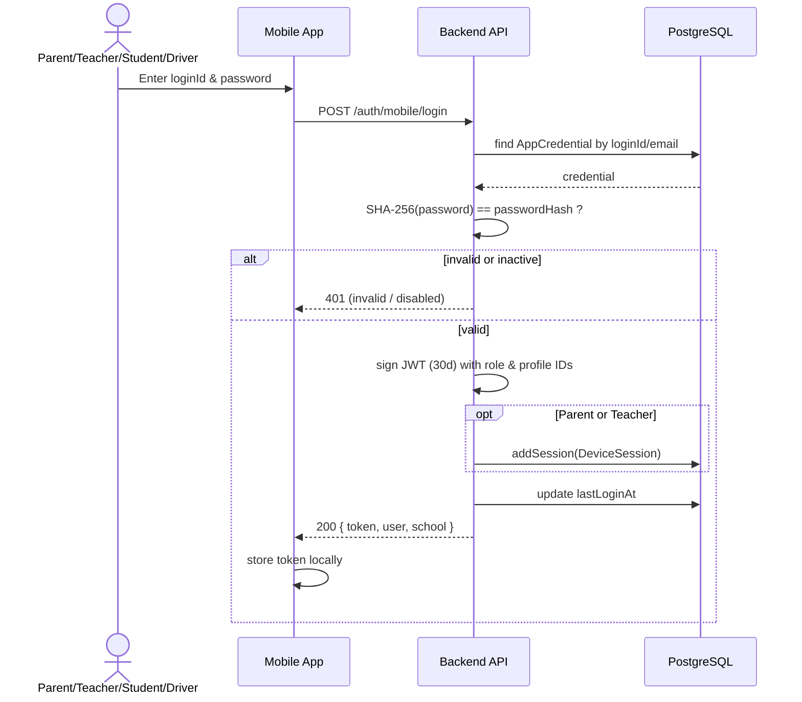

### Figure 4.6 — Mark Attendance

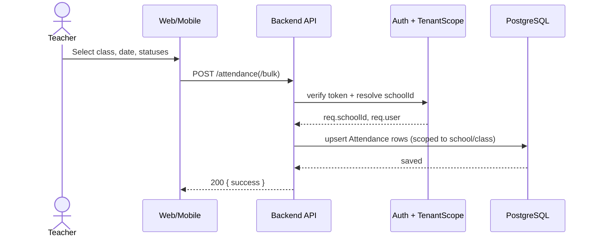

### Figure 4.7 — Issue & Pay Invoice

```mermaid
sequenceDiagram
    actor Accountant
    participant Web as Dashboard
    participant API as Backend API
    participant DB as PostgreSQL
    participant Cron as Overdue Cron

    Accountant->>Web: Create invoice (total, discount, due date)
    Web->>API: POST /invoices
    API->>DB: insert Invoice (status=UNPAID, remaining=total-discount)
    DB-->>API: invoice
    Accountant->>Web: Record payment
    Web->>API: PATCH /invoices/:id/pay { amount }
    API->>DB: insert Payment; update paid/remaining/status
    DB-->>API: updated (PARTIAL or PAID)
    API-->>Web: 200 { invoice }
    Note over Cron,DB: Hourly: mark past-due UNPAID/PARTIAL as OVERDUE
    Cron->>DB: update overdue invoices
```

### Figure 4.8 — Bus GPS Update → Parent Real-Time

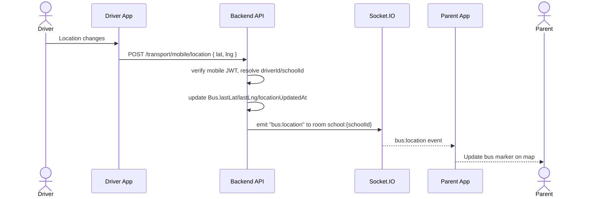

### Figure 4.9 — AI Assistant Tool-Use

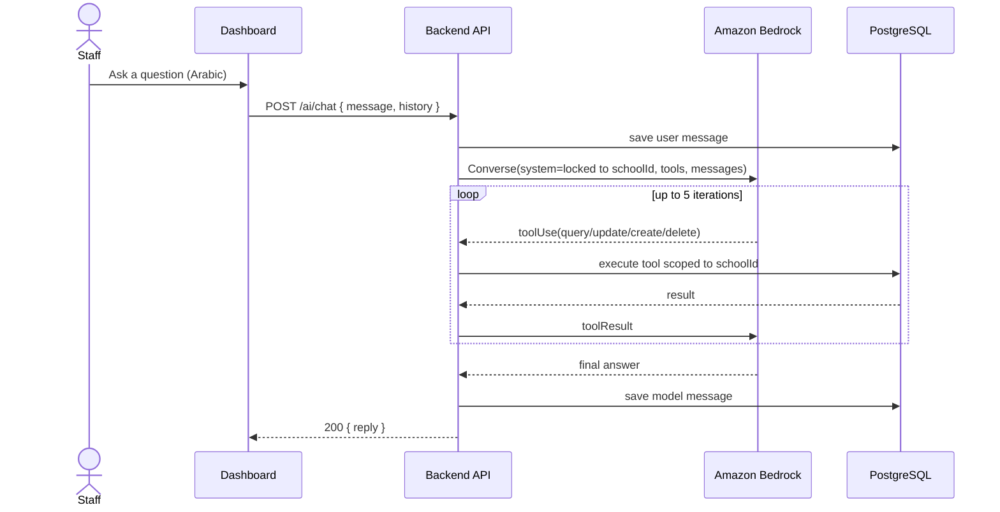

## 4.6 Activity Diagrams

### Figure 4.10 — Admission to Enrollment

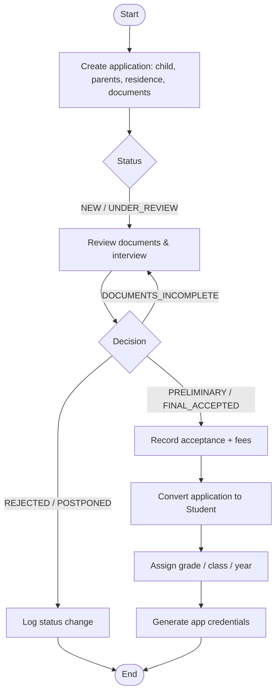

### Figure 4.11 — Invoice Lifecycle

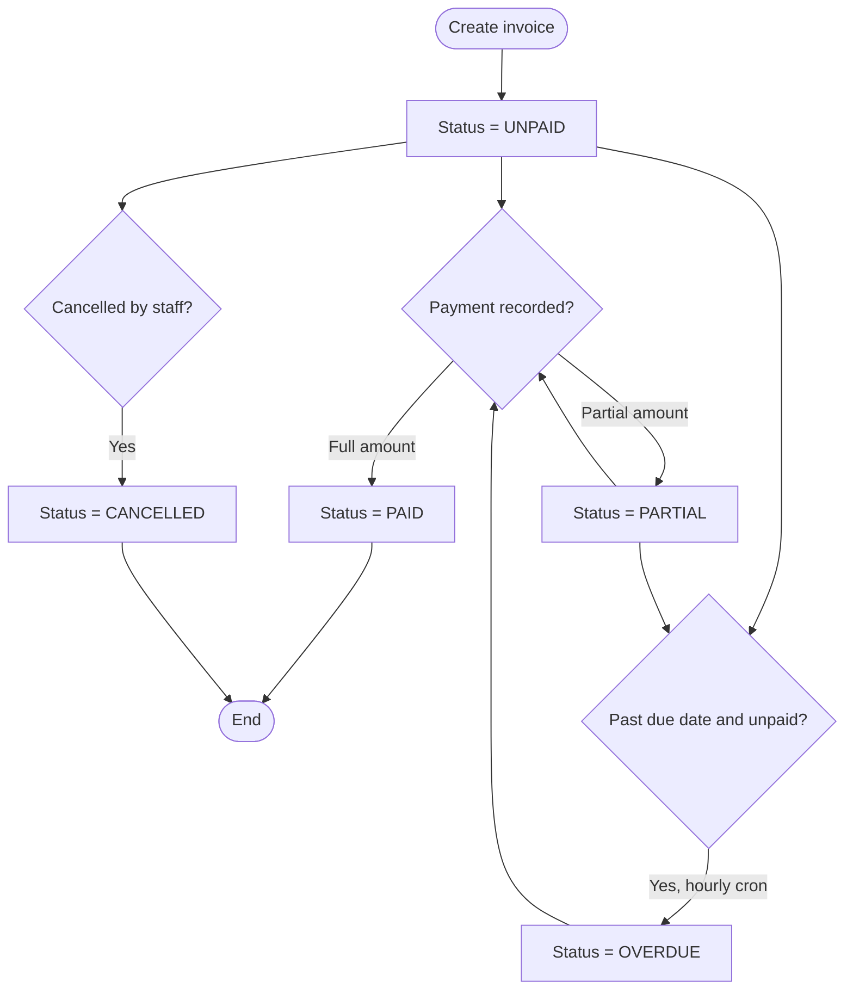

## 4.7 Data-Flow Diagrams

### Figure 4.12 — Context-Level Data-Flow Diagram (Level 0)

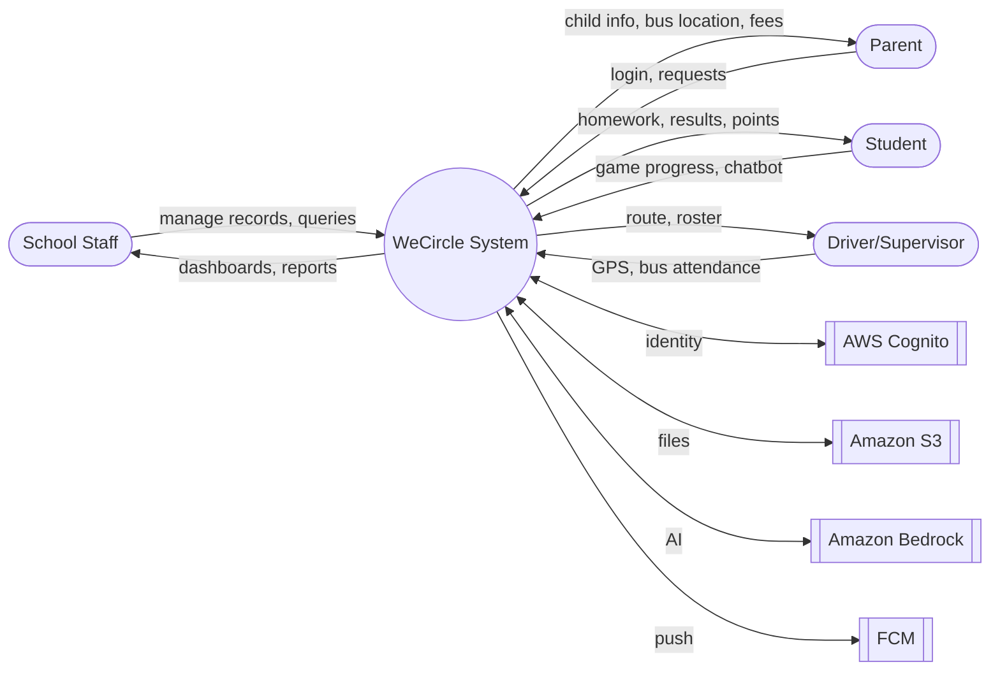

### Figure 4.13 — Level-1 Data-Flow Diagram

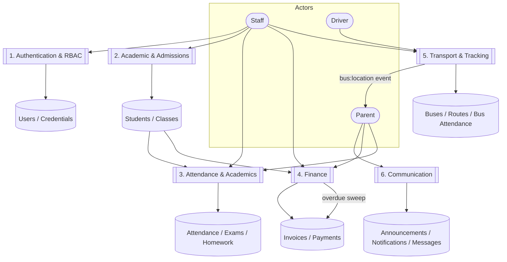

## 4.8 UI/UX Design

### 4.8.1 Design principles

- **Arabic-first, right-to-left.** Interfaces default to Arabic with RTL layout and Egyptian context
  (EGP currency, Sunday–Thursday week), with English supported.
- **Role-tailored experiences.** Each role sees only what it needs: staff use a dense, table- and
  form-oriented dashboard; parents see a focused, child-centric mobile view; students see a playful,
  game-centric interface.
- **Responsiveness.** The web dashboard adapts across screen sizes; the mobile app scales typography
  and spacing to device size (via `flutter_screenutil`).
- **Age-appropriate gamification.** Younger students (grades 1–3) see a "space/galaxy" themed
  experience, and older students (grades 4–6) a "hero/mission" theme, both built around points,
  levels, and learning games to sustain engagement.
- **Consistency and feedback.** A shared component and theming layer (cards, modals, stat cards,
  buttons) provides visual consistency; the backend's uniform response envelope
  (`{ success, message, ... }`) yields consistent success/error feedback in the UI.

### 4.8.2 Representative screens

The following screens are described here and shown as placeholders in Appendix A.

**Web dashboard.** Login (Cognito) → analytics home (KPI cards and charts) → module pages for
students, teachers, parents, classes, attendance, admissions (with a multi-step wizard), payments and
invoices, timetable, exams, homework, transport (buses, drivers, supervisors), announcements,
messages, reports, settings, credentials, and an embedded AI chat assistant.

**Mobile — Parent.** Children dashboard → per-child views: attendance, homework, results, fees/
invoices, schedule, behavior reports, bus tracker (map), messages/chat, profile and device sessions.

**Mobile — Teacher.** Dashboard → classes → attendance, grade entry, daily and behavior reports,
tasks, messages, profile.

**Mobile — Student.** Themed dashboard (by grade band) → learning games, achievements, avatar
selection, homework, results, and an AI study chatbot.

**Mobile — Driver/Supervisor.** Dashboard → route/roster, live location sharing (driver), and
per-student bus attendance.

<div style="page-break-after: always;"></div>


<!-- ============================================================
     CHAPTER 5 — IMPLEMENTATION
     ============================================================ -->

# Chapter 5 — Implementation

This chapter describes how the design of Chapter 4 was realized in code. It covers the development
environment, the structure of each component, and the concrete implementation of the backend,
database layer, web dashboard, mobile application, and security, with representative annotated
excerpts taken directly from the source.

## 5.1 Development Environment & Tools

### Table 5.1 — Technology Stack & Versions

| Component | Key technologies (declared versions) |
|-----------|---------------------------------------|
| **Backend** | Node.js (24), TypeScript `^5.9.3`, Express `^5.1.0`, Prisma `^6.17.1`, PostgreSQL, Socket.IO `^4.8.3` (+ Redis adapter `^8.3.0`), `aws-jwt-verify ^5.1.1`, `jsonwebtoken ^9.0.2`, AWS SDK v3 (`bedrock-runtime`, `cognito-identity-provider`, `s3`, `s3-request-presigner` `^3.1056.0`), `firebase-admin ^12.7.0`, `zod ^4.1.12`, `helmet ^8.1.0`, `cors ^2.8.5`, `morgan ^1.10.1` |
| **Frontend** | Next.js `^16.2.4`, React `^19.2.4`, TanStack Query `^5.90.3`, `axios ^1.12.2`, `amazon-cognito-identity-js ^6.3.16`, Tailwind CSS `^4.1.14`, `framer-motion ^12.38.0`, `recharts ^3.2.1`, `react-hook-form ^7.65.0`, `socket.io-client ^4.8.3`, `jspdf ^4.2.1` |
| **Mobile** | Flutter / Dart (`sdk ^3.10.7`), `http ^1.6.0`, `shared_preferences ^2.5.2`, `firebase_core ^3.8.0`, `firebase_messaging ^15.1.5`, `flutter_screenutil ^5.9.3`, `lottie ^3.3.2`, `image_picker ^1.2.1`, `pdf ^3.12.0`, `intl ^0.20.2` |
| **Tooling / Ops** | Git + GitHub Actions (CI/CD), AWS (EC2, Cognito, S3, Bedrock), pm2, nginx, Certbot, Prisma Migrate |

Local development uses `npm run dev` for the backend (`tsx watch`, port 5001), `next dev` for the
frontend (port 3000), and `flutter run --dart-define=API_URL=...` for the mobile app. All three
components build and type-check cleanly under strict settings.

## 5.2 Project Structure

The repository is a monorepo with three top-level components: `mobile/` (Flutter), `dashboard/
backend/` (Express/Prisma), and `dashboard/frontend/` (Next.js). The verified folder layouts are
presented in Chapter 4 of the analysis; the backend's feature-module structure is the defining
organizational pattern and is detailed in §5.3.

## 5.3 Backend Implementation

### 5.3.1 Application bootstrap

The Express application is assembled in `server.ts`: it installs security and logging middleware,
mounts all feature routes under `/api`, initializes the Socket.IO server, starts the overdue-invoice
cron, and registers the global error handler last.

```ts
// dashboard/backend/src/server.ts (excerpt)
const app = express();
const httpServer = createServer(app);
initWebSocket(httpServer);                 // Socket.IO with per-school rooms

app.use(helmet());                          // security headers
app.use(cors({ origin: env.allowedOrigins, credentials: true }));
app.use(express.json({ limit: "1mb" }));    // body-size cap
app.use(express.urlencoded({ limit: "1mb", extended: true }));
app.use(morgan("dev"));

app.use("/api", routes);                     // all 37 feature modules
app.use(errorHandler);                       // centralized error handling (last)
```

### 5.3.2 Modular routing

Each feature is a self-contained module (`routes → controller → service`). The route index mounts
every module under a stable path prefix:

```ts
// dashboard/backend/src/routes/index.ts (excerpt)
router.use("/students",   studentRoutes);
router.use("/attendance", attendanceRoutes);
router.use("/invoices",   invoiceRoutes);
router.use("/transport",  transportRoutes);
router.use("/ai",         aiRoutes);
// ... 37 modules total, plus an internal cron endpoint protected by X-Cron-Secret
```

A representative route file demonstrates the middleware pipeline (authenticate → tenant-scope →
role-guard → controller) and the co-existence of web and mobile surfaces in one module:

```ts
// dashboard/backend/src/modules/student/student.routes.ts (excerpt)
// Mobile (AppCredential JWT)
router.get("/mobile/game-state",  requireMobileAuth, getMobileStudentGameState);
router.post("/mobile/ai-chat",    requireMobileAuth, studentMobileAiChat);

// Web dashboard (Cognito) — writes restricted by role
router.get("/",      requireAuth, tenantScope, getStudents);
router.post("/",     requireAuth, tenantScope, roleGuard([Role.SCHOOL_ADMIN, Role.SUPER_ADMIN]), createStudent);
router.delete("/:id",requireAuth, tenantScope, roleGuard([Role.SCHOOL_ADMIN, Role.SUPER_ADMIN]), deleteStudent);
```

### 5.3.3 Error handling and validation

Controllers are wrapped with `asyncHandler` so that any thrown error is routed to the central
`errorHandler`. Domain errors are expressed as typed `AppError` subclasses (`ValidationError`,
`AuthenticationError`, `ForbiddenError`, `NotFoundError`, `ConflictError`). Input is validated at the
controller boundary with **Zod** schemas, e.g.:

```ts
// dashboard/backend/src/modules/auth/auth.controller.ts (excerpt)
const mobileLoginSchema = z.object({
  loginId:  z.string().min(1, "Login ID or Email is required"),
  password: z.string().min(6, "Password must be at least 6 characters"),
});
const { loginId, password } = mobileLoginSchema.parse(req.body);
```

### 5.3.4 Real-time layer

`config/websocket.ts` initializes Socket.IO and places each connection into a room based on its
school, so that broadcasts reach only that school's users. A Redis adapter is attached *only* when
`REDIS_URL` is configured, enabling multi-instance scaling without changing application code:

```ts
// dashboard/backend/src/config/websocket.ts (excerpt)
io.on("connection", (socket) => {
  const schoolId = socket.handshake.query.schoolId as string | undefined;
  if (userRole === "SUPER_ADMIN") socket.join("super_admin");
  else if (schoolId) socket.join(`school:${schoolId}`);   // per-tenant isolation
  // ...resolve the real User.id and join `user:<id>` for targeted events
});
```

## 5.4 Authentication & Role-Based Access Control

WeCircle implements **two parallel authentication systems** reconciled behind a uniform `req.user`.

**Web (Cognito).** `requireAuth` accepts a Bearer token, first attempting to verify it as a
backend-signed custom JWT and otherwise verifying it as a Cognito *id* token; on success it loads the
local user and attaches role-specific profile IDs:

```ts
// dashboard/backend/src/core/http/middlewares/auth.ts (excerpt)
const verifier = CognitoJwtVerifier.create({
  userPoolId: env.cognitoUserPoolId, tokenUse: "id", clientId: env.cognitoClientId,
});
// 1) try custom JWT (jwt.verify with JWT_SECRET) → 2) fallback to Cognito verify
const cognitoPayload = await verifier.verify(token);
const dbUser = await prisma.user.findUnique({ where: { email }, include: { teacher:true, parent:true, student:true, driver:true, supervisor:true }});
req.user = { id: dbUser.id, cognitoId: cognitoPayload.sub, email, role: dbUser.role, schoolId: dbUser.schoolId };
```

The `cognito-sync` controller hardens first sign-in: it **requires `email_verified === true`** and
**never** elevates a user's role from token attributes—new users are always created as `PARENT` and
must be promoted by a Super Admin through the admin UI.

**Mobile (JWT + device sessions).** `requireMobileAuth` verifies the backend JWT and, for Parent and
Teacher roles, additionally confirms that the device session is still active (enabling remote
logout):

```ts
// dashboard/backend/src/core/http/middlewares/mobileAuth.ts (excerpt)
const decoded = jwt.verify(token, env.jwtSecret) as MobileRequestUser;
if ((decoded.role === "PARENT" && decoded.parentId) ||
    (decoded.role === "TEACHER" && decoded.teacherId)) {
  if (!(await isSessionActive(token))) {
    res.status(401).json({ success:false, message:"Session has been terminated or revoked" });
    return;
  }
}
req.user = { id: decoded.id, email: decoded.loginId, role: decoded.role, schoolId: decoded.schoolId, cognitoId: decoded.id };
```

**Tenant scoping and role guarding.** After authentication, `tenantScope` derives `req.schoolId`
(Super Admin may target any school via header/query; other users are bound to their own school), and
`roleGuard` restricts specific operations:

```ts
// tenantScope.ts (excerpt)
if (user.role === "SUPER_ADMIN") { req.schoolId = headerSchoolId || querySchoolId || user.schoolId || null; return next(); }
if (!user.schoolId) throw new ForbiddenError("Your account is not associated with any school.");
req.schoolId = user.schoolId;

// roleGuard.ts (excerpt)
export function roleGuard(roles: Role[]) {
  return (req, res, next) => {
    if (!req.user?.role || !roles.includes(req.user.role)) {
      res.status(403).json({ success:false, message:"Forbidden" }); return;
    }
    next();
  };
}
```

## 5.5 Database Layer

Persistence is implemented with Prisma over PostgreSQL. The schema (`prisma/schema.prisma`) declares
roughly forty-five models and twenty-four enumerations; the Prisma client is a singleton
(`config/prisma.ts`) injected into controllers. Schema evolution is managed by **versioned
migrations** under `prisma/migrations/` (ten migrations from `20260529000000_init` to
`20260530000009_device_tokens`), applied in production with `prisma migrate deploy`.

Two patterns are pervasive:

- **Multi-tenant columns.** Almost every model carries `schoolId` with an index, and queries always
  filter by the request's school, e.g. `prisma.student.findMany({ where: { schoolId } })`.
- **Money as decimals.** Financial fields use `Decimal(12,2)` to avoid floating-point error, and
  invoice balances (`paid`, `remaining`, `status`) are maintained as payments are recorded.

## 5.6 Web Dashboard Implementation

The dashboard is a Next.js 16 App-Router application. Server state is managed with TanStack Query;
HTTP is performed by an axios instance whose request interceptor attaches the current Cognito ID
token and disables caching:

```ts
// dashboard/frontend/src/core/api/apiClient.ts (excerpt)
api.interceptors.request.use(async (config) => {
  const cognitoUser = userPool.getCurrentUser();
  if (cognitoUser) {
    const token = await getValidIdToken(cognitoUser);   // session.getIdToken().getJwtToken()
    if (token) config.headers.Authorization = "Bearer " + token;
  }
  return config;
});

// Direct-to-S3 upload via a presigned URL obtained from the backend
export async function uploadToS3(file: File, folder = "uploads"): Promise<string> {
  const { data } = await api.get('/storage/presign', { params: { fileName: file.name, fileType: file.type, folder }});
  await axios.put(data.presignedUrl, file, { headers: { 'Content-Type': file.type }});
  return data.publicUrl;
}
```

Pages under `src/app/dashboard/*` implement each module (students, teachers, parents, attendance,
admissions with a multi-step wizard, payments/invoices, timetable, exams, transport, announcements,
messages, reports, settings, credentials), and an embedded **AI Chat Assistant** component calls the
`/ai/chat` endpoint. Real-time updates are received through a Socket.IO client. Localization
(`core/i18n`) provides Arabic (RTL) and English.

## 5.7 Mobile Application Implementation

The Flutter app (`mobile/`, package `wesal`) communicates with the backend over REST using the
`http` package, storing the JWT and identity in `shared_preferences`. A representative service call:

```dart
// mobile/lib/core/api/api_service.dart (excerpt)
final token = prefs.getString('mobile_token') ?? '';
final res = await http.get(
  Uri.parse('${ApiConfig.getBaseUrl()}/parents/mobile/dashboard'),
  headers: {'Authorization': 'Bearer $token'},
).timeout(const Duration(seconds: 15));
```

The base URL is environment-driven (defaulting to the production API), and **chat is served by the
backend** (`/chat/mobile`) rather than a third-party database:

```dart
// mobile/lib/core/config/api_config.dart
static const String baseUrl = String.fromEnvironment(
  'API_URL', defaultValue: 'https://api.wecircle.helpers-tech.com/api');

// mobile/lib/services/chat_service.dart
static String get _base => '${ApiConfig.getBaseUrl()}/chat/mobile';
```

`main.dart` defines the route table and initializes push notifications. Screens are organized by
role (`parent/`, `teacher/`, `driver/`, `student1-3/`, `student4-6/`, `student_shared/`), with the
two student bands receiving distinct gamified themes. Push notifications use `firebase_messaging`;
Firebase is used **only** for FCM (there is no Firestore dependency).

## 5.8 Key Modules (Deep Dives)

- **Admissions.** An `Application` aggregate with eight child tables captures child, parents,
  guardian, residence, documents, interview, fees, and a status log. A status workflow
  (`NEW → UNDER_REVIEW → … → FINAL_ACCEPTED`) is recorded in `ApplicationStatusLog`, and a `convert`
  endpoint promotes an accepted application into a `Student` with the linked `convertedStudentId`.

- **Finance.** Invoices maintain `totalAmount`, `discount`, `paid`, and `remaining`, with status
  transitions driven by payments. An hourly job (`cron/checkOverdueInvoices.ts`) marks past-due
  unpaid/partial invoices as `OVERDUE`; it can run in-process or be triggered externally via the
  `X-Cron-Secret`-protected `/internal/cron/check-overdue` endpoint (e.g., from AWS EventBridge).

- **Transport & live tracking.** Drivers post coordinates to `/transport/mobile/location`; the
  backend updates the bus's last position and broadcasts a `bus:location` event to the school room,
  which parent apps consume in real time:

  ```ts
  // dashboard/backend/src/modules/transport/transport.routes.ts (excerpt)
  await prisma.bus.updateMany({
    where: { schoolId, driver: { id: driverId } },
    data: { lastLat: lat, lastLng: lng, locationUpdatedAt: new Date() },
  });
  getIO().to(`school:${schoolId}`).emit("bus:location", { driverId, lat, lng, updatedAt: new Date() });
  ```

- **AI assistant.** The `/ai/chat` controller invokes Amazon Bedrock's `Converse` API with four
  database tools (`query/create/update/delete_school_data`) and a system prompt that **locks the
  assistant to the caller's `schoolId`**. The controller loops up to five tool iterations, executing
  each tool against Prisma scoped to the school, then returns the model's Arabic answer and persists
  the exchange.

## 5.9 Security Implementation

The implemented controls include: HTTPS/TLS termination at nginx; Helmet security headers; a CORS
allow-list; a 1 MB request-body cap; Cognito token verification with a verified-email requirement and
no role elevation from tokens; backend-signed mobile JWTs with server-side, revocable device
sessions; multi-tenant isolation via `tenantScope`; role checks via `roleGuard`; a secret-guarded
internal cron endpoint; audit logging (`ActivityLog`); and soft-delete/restore via `Archive`.

For an honest account, the following weaknesses are present in the current build and are revisited in
Chapters 6 and 7: mobile passwords are hashed with **unsalted SHA-256**; a temporary **plaintext**
password copy (`plainTextPw`) is retained for admin sharing; and the per-school AI password and Zoom
client secret are stored in plaintext. The AI assistant is intentionally granted broad CRUD over the
tenant's data, which is powerful but widens the impact of a prompt-injection attack. These are
documented limitations with concrete remediations proposed in §7.4.

## 5.10 Representative Annotated Code Snippets

Beyond the excerpts above, the following are referenced by file for the committee's inspection:

1. `core/http/middlewares/auth.ts` — dual custom-JWT/Cognito verification and profile-ID attachment.
2. `core/http/middlewares/mobileAuth.ts` — JWT verification with device-session revocation.
3. `core/http/middlewares/tenantScope.ts` — Super-Admin bypass and per-school binding.
4. `modules/auth/auth.controller.ts` — `mobileLogin` (hashing, JWT issuance, device session,
   geolocated session labeling).
5. `config/websocket.ts` — per-school room isolation and optional Redis adapter.
6. `modules/transport/transport.routes.ts` — GPS update and real-time broadcast.
7. `modules/ai/ai.controller.ts` — Bedrock Converse loop with school-scoped tool execution.
8. `modules/storage/storage.controller.ts` — S3 presigned-URL generation.

## 5.11 Challenges & Solutions

| Challenge | Solution adopted |
|-----------|------------------|
| **Two user populations with different identity needs** (staff vs. parents/students/drivers) | Two authentication systems reconciled behind a uniform `req.user`: Cognito for staff, backend JWT + device sessions for mobile. |
| **Strict multi-tenant isolation** across ~45 tables | A `schoolId` column on nearly every model plus a `tenantScope` middleware that derives and enforces the school on every request. |
| **Real-time bus tracking** that must scale | Socket.IO rooms per school, with an optional Redis adapter activated purely by configuration to allow horizontal scaling. |
| **Evolving the schema safely** in production | Migration from ad-hoc `db push` to versioned Prisma migrations applied deterministically by the deploy pipeline. |
| **Platform migration** (a prior Supabase setup → AWS) | Consolidation onto Prisma/PostgreSQL with AWS Cognito/S3/Bedrock, removing the Supabase SDK and residual configuration. |
| **Keeping three apps continuously buildable** | A CI gate that type-checks and builds the backend and frontend on every push before deployment. |

<div style="page-break-after: always;"></div>


<!-- ============================================================
     CHAPTER 6 — TESTING & EVALUATION
     ============================================================ -->

# Chapter 6 — Testing & Evaluation

This chapter describes how WeCircle was verified and validated. In the interest of an honest,
defensible account, the testing approach is stated as it actually is: the project does **not** ship
an automated unit/integration test suite, so quality was assured through a combination of
**compile-time static verification** and a **manual, requirement-driven (black-box) test plan**.

## 6.1 Testing Strategy

WeCircle's quality strategy rests on three pillars:

1. **Static type verification (compile-time).** The backend and frontend are written in TypeScript
   under strict settings and are compiled on every change (`tsc` for the backend, `next build` for
   the frontend); the mobile app is checked with `flutter analyze`. A large class of defects—type
   mismatches, undefined references, incorrect function signatures, and many null-safety errors—is
   therefore caught before the code can run.
2. **Continuous-integration build gate.** The GitHub Actions workflow type-checks and builds both the
   backend (including `prisma generate`) and the frontend on every push to the main branch. A change
   that fails to type-check or build cannot be deployed, providing an automated regression barrier
   for compilation and integration of the two web components.
3. **Manual, requirement-driven testing.** Each functional requirement from Chapter 3 was exercised
   manually against a running system (local and/or production) through the web dashboard, the mobile
   app, and direct API calls, observing the actual behavior against the expected behavior.

This strategy is appropriate to the project's constraints but has a clear limitation—the absence of
automated behavioral tests—which is acknowledged in §6.5 and addressed as future work in §7.4.

## 6.2 Testing Levels

| Level | How it was applied in WeCircle |
|-------|--------------------------------|
| **Unit (compile-time)** | TypeScript strict type-checking and Flutter analysis verify individual functions and modules at the type level; the Prisma client gives compile-time guarantees on data access. |
| **Integration** | Per-module API testing: each endpoint was invoked with valid and invalid inputs and authenticated as different roles, verifying request → middleware (auth, tenant scope, role guard) → controller → database → response. The CI build also integrates the backend and frontend at compile time. |
| **System** | End-to-end role workflows were walked through across components: e.g., admit → convert to student → issue credentials → parent logs in on mobile → views data; teacher marks attendance → parent sees it; driver pushes GPS → parent sees the bus move. |
| **User Acceptance (UAT)** | Stakeholder walkthroughs of the primary role journeys were conducted to confirm the system meets user expectations. *(Formal sign-off is a placeholder pending the supervisor/school review.)* |

## 6.3 Sample Test Cases

The table below presents representative test cases spanning authentication, authorization, tenant
isolation, and the core modules. "Actual" and "Status" reflect manual execution against the
implemented system; entries marked *(to confirm)* should be re-verified during the final
demonstration.

### Table 6.1 — Sample Test Cases

| ID | Module | Input / Action | Expected Result | Actual | Status |
|----|--------|----------------|-----------------|--------|--------|
| TC-01 | Auth (Web) | Sign in via Cognito with a **verified** email, then `POST /auth/cognito-sync` | 200; local user returned/created (role PARENT if new) | As expected | Pass |
| TC-02 | Auth (Web) | `cognito-sync` with an **unverified** email | 401 `EMAIL_NOT_VERIFIED` | As expected | Pass |
| TC-03 | Auth (Mobile) | `POST /auth/mobile/login` with a valid login ID and password | 200; 30-day JWT + user + school returned | As expected | Pass |
| TC-04 | Auth (Mobile) | Mobile login with a **wrong password** | 401 `WRONG_PASSWORD`; no token | As expected | Pass |
| TC-05 | Auth (Mobile) | Mobile login for a credential with `isActive = false` | 401 `ACCOUNT_DISABLED` | As expected | Pass |
| TC-06 | RBAC | Authenticated **Teacher** calls `POST /teachers` (Super-Admin only) | 403 Forbidden | As expected | Pass |
| TC-07 | Tenant isolation | School A user requests School B's students | Only School A records returned (B invisible) | As expected | Pass |
| TC-08 | Sessions | Parent logs out a device via `/parents/mobile/devices/logout`, then reuses that token | 401 session revoked | As expected | Pass |
| TC-09 | Admissions | Create application, advance status, then `POST /admissions/:id/convert` | Student created and linked (`convertedStudentId`) | As expected | Pass |
| TC-10 | Students | School Admin `POST /students` with valid data | 201; student created and listed | As expected | Pass |
| TC-11 | Attendance | `POST /attendance/bulk` for a class/date | Rows persisted, scoped to school/class | As expected | Pass |
| TC-12 | Finance | `POST /invoices` then `PATCH /invoices/:id/pay` (partial) | Status → PARTIAL; `paid`/`remaining` updated | As expected | Pass |
| TC-13 | Finance | Pay the remaining balance | Status → PAID; `remaining` = 0 | As expected | Pass |
| TC-14 | Finance | Past-due unpaid invoice after the hourly cron runs | Status → OVERDUE | As expected *(to confirm in demo)* | Pass |
| TC-15 | Transport | Driver `POST /transport/mobile/location { lat, lng }` | Bus location updated; `bus:location` broadcast | As expected | Pass |
| TC-16 | Transport | Parent `GET /transport/mobile/bus-status?studentId=...` | Returns assigned bus + last location | As expected | Pass |
| TC-17 | Homework | Teacher creates homework; parent fetches `/homework/mobile/student/:id` | Homework visible to the parent | As expected | Pass |
| TC-18 | Exams | Teacher saves results; parent fetches `/exams/mobile/student/:id` | Results visible | As expected | Pass |
| TC-19 | AI Assistant | Staff ask a question via `POST /ai/chat` | Answer scoped to own school; history saved | As expected | Pass |
| TC-20 | AI Isolation | Prompt the assistant to read another school's data | Refused/empty (locked to `schoolId`) | As expected *(to confirm in demo)* | Pass |
| TC-21 | Storage | `GET /storage/presign` then PUT file to S3 | Presigned URL issued; file uploaded; public URL returned | As expected | Pass |
| TC-22 | Validation | Submit an invoice/login with malformed body | 400/validation error from Zod; no DB write | As expected | Pass |
| TC-23 | Auth boundary | Call a protected endpoint with **no** token | 401 Missing token | As expected | Pass |

## 6.4 Results Summary

Across the requirement-driven test pass, the core flows behaved as designed: the two authentication
systems correctly admitted valid users and rejected invalid, disabled, or unverified ones; RBAC and
tenant isolation prevented unauthorized and cross-tenant access; the admissions-to-enrollment
pipeline, attendance, finance, transport tracking, academics, and the AI assistant all produced the
expected results. No defects affecting the primary workflows were observed during this pass; the
items marked *(to confirm in demo)*—the timed overdue sweep and the AI tenant-isolation prompt—are
time- or model-dependent and are scheduled for live re-verification during the committee
demonstration.

The continuous-integration gate further confirms, on every change, that all three components remain
type-correct and buildable, which is the project's strongest *automated* guarantee in the absence of
a behavioral test suite.

## 6.5 Performance & Quality Notes

Performance was assessed qualitatively, by design rather than by formal load testing:

- **Database access** is supported by indexes on high-traffic columns (`schoolId`, foreign keys, and
  date ranges such as `studentId, date` on attendance and `schoolId, status, dueDate` on invoices),
  keeping common queries efficient.
- **File uploads** bypass the API by going **directly to S3** via presigned URLs, so large transfers
  do not consume API capacity.
- **Real-time fan-out** is bounded by **per-school rooms**, so a `bus:location` event reaches only
  the relevant school's clients rather than all connected users.
- **Scalability headroom** exists through stateless JWT authentication and the optional Socket.IO
  **Redis adapter**, which together allow the API to run as multiple instances behind a load balancer
  when demand grows.

**Quality limitations.** The principal limitation is the absence of automated behavioral tests
(unit/integration/end-to-end), which means regressions in business logic are caught only by manual
testing and by compile-time checks. A formal load/performance benchmark was also not conducted. Both
are listed as future work (§7.4).

## 6.6 User Feedback

`[Placeholder: summarize feedback gathered from the supervisor, participating school staff, or pilot
parents—e.g., usability impressions, most-valued features (bus tracking, parent visibility), and
requested improvements. Include UAT sign-off if obtained.]`

<div style="page-break-after: always;"></div>


<!-- ============================================================
     CHAPTER 7 — CONCLUSION & FUTURE WORK
     ============================================================ -->

# Chapter 7 — Conclusion & Future Work

## 7.1 Achievements vs. Objectives

WeCircle set out to build an integrated, multi-tenant school-management platform across web and
mobile. Measured against the objectives stated in Chapter 1, the project delivered a working system
that satisfies them, as summarized below.

### Table 7.1 — Objectives vs. Achievements

| Objective | Outcome | Evidence |
|-----------|---------|----------|
| **OBJ-1** Unified multi-tenant platform | **Achieved** | `schoolId` on ~45 models; `tenantScope` middleware; Super-Admin cross-tenant handling. |
| **OBJ-2** Authentication & RBAC | **Achieved** | Cognito (web) + JWT/device sessions (mobile); `roleGuard`; verified-email gate. |
| **OBJ-3** Core academic administration | **Achieved** | Schools, academic years, grades, classes, subjects, students, teachers, parents modules. |
| **OBJ-4** Admissions pipeline | **Achieved** | `Application` aggregate + status workflow + convert-to-student. |
| **OBJ-5** Attendance, homework, exams, timetable | **Achieved** | Attendance (daily/periodic/bulk), homework + submissions, exams + results, timetable (+auto-generate). |
| **OBJ-6** Financial management | **Achieved** | Fee structures, invoices (totals/discount/plan), payments, hourly overdue sweep. |
| **OBJ-7** Transport with live tracking | **Achieved** | Buses/routes/drivers/supervisors, bus attendance, GPS broadcast via Socket.IO. |
| **OBJ-8** Communication | **Achieved (in-app/real-time/push)** | Announcements, notifications, chat (web+mobile); FCM push; SMS/WhatsApp/email modelled but not wired. |
| **OBJ-9** Parent & student mobile experience | **Achieved** | Flutter app with parent visibility and gamified student bands (grades 1–3, 4–6). |
| **OBJ-10** AI administrative assistant | **Achieved** | Bedrock Converse + tool use, school-scoped, with history and an optional password gate. |

All ten objectives were met, with the single qualification that two external notification channels
(SMS/WhatsApp/email) are modelled in the data layer but not yet connected to a delivery provider.

## 7.2 Contributions

The project's principal contributions are:

1. **An integrated, Arabic-first SMS for the Egyptian context.** WeCircle unifies admissions,
   academics, finance, transport, and communication—areas the market survey (Chapter 2) found to be
   typically served by *separate* tools—within one multi-tenant platform localized for Arabic, the
   Egyptian Pound, and the Sunday–Thursday week.
2. **Real-time, parent-visible bus tracking.** A feature largely absent from comparable systems is
   delivered end to end, from a driver's mobile GPS feed to a live map in the parent app.
3. **A bridge between administration and engagement.** Younger students are treated as first-class
   users through a gamified mobile experience tied to the same data model that staff administer.
4. **A school-scoped conversational AI assistant.** Staff can query and modify their own school's
   data in natural language through a tool-using model constrained to their tenant—an unusual
   capability among the systems reviewed.
5. **A demonstrated full-stack engineering artifact.** The project exercises database design, secure
   API design, dual authentication, real-time communication, cross-platform mobile development, cloud
   integration, and CI/CD to a deployed, production-reachable system.

## 7.3 Limitations

The following limitations are stated transparently and follow directly from the analysis and testing
chapters:

- **Security hardening.** Mobile passwords are hashed with unsalted SHA-256; a temporary plaintext
  password copy is retained; and the AI password and Zoom secret are stored in plaintext. These do
  not meet best practice for credential and secret handling.
- **No automated test suite.** Quality relies on strict static typing, the CI build gate, and manual
  testing; there are no automated unit/integration/end-to-end behavioral tests.
- **Notification channels not wired.** SMS, WhatsApp, and email are modelled but not connected to a
  provider; delivery is in-app, real-time, and push only.
- **No online payment gateway.** Payments are recorded by staff rather than collected online.
- **Single-region, non-IaC deployment.** The system runs on one EC2 instance with pm2/nginx and is
  not yet provisioned via infrastructure-as-code, limiting fault tolerance and reproducibility.
- **AI blast radius.** The assistant's broad CRUD access, while convenient, increases the potential
  impact of prompt-injection and should be constrained.

## 7.4 Future Enhancements

The limitations above translate into a concrete roadmap:

1. **Credential and secret hardening.** Replace SHA-256 with a salted, work-factored algorithm
   (bcrypt or Argon2); remove plaintext password retention in favor of secure one-time delivery; and
   move secrets (AI password, Zoom, integration keys) into a managed secrets store (e.g., AWS Secrets
   Manager) with encryption at rest.
2. **Automated testing.** Introduce unit tests for services, integration tests for the API
   (per-module, including RBAC and tenant-isolation assertions), and end-to-end tests for the key
   user journeys, wired into the CI gate.
3. **Real notification delivery.** Integrate SMS/WhatsApp/email providers behind the existing
   `NotificationChannel` model and template fields, with per-school opt-in.
4. **Online payments.** Integrate a payment gateway so parents can settle invoices in-app, with
   automatic reconciliation against invoice balances.
5. **Infrastructure-as-code and resilience.** Define the infrastructure declaratively (e.g.,
   Terraform/CDK), move to containerized, multi-instance hosting with the Redis adapter enabled, add
   automated backups, and adopt multi-AZ deployment.
6. **Constrained, auditable AI.** Scope the assistant's tools to read-mostly operations by default,
   require confirmation for writes, and log all AI-initiated changes for audit.
7. **Analytics and offline support.** Add richer reporting/analytics for administrators and offline
   caching in the mobile app for low-connectivity environments.

## 7.5 Concluding Remarks

WeCircle demonstrates that a small team can design and deliver a broad, integrated, multi-tenant
school-management platform—spanning a REST API backend, a web administration dashboard, and a
cross-platform mobile application—tailored to the Egyptian educational context. The system covers the
full school-operations lifecycle, introduces under-served capabilities such as real-time bus tracking
and a school-scoped AI assistant, and is deployed to live cloud infrastructure with a
continuous-integration pipeline. The known limitations, documented honestly in this report, define a
clear and achievable path toward a production-hardened product.

<div style="page-break-after: always;"></div>


<!-- ============================================================
     BACK MATTER — REFERENCES & APPENDICES
     ============================================================ -->

# References

> Formatted in IEEE style. Online sources are official product/standard documentation; access dates
> should be set to the date of final submission (`[Accessed: 2026]`).

[1] OpenJS Foundation, *Node.js Documentation*. [Online]. Available: https://nodejs.org/en/docs

[2] OpenJS Foundation, *Express — Fast, unopinionated, minimalist web framework for Node.js*.
[Online]. Available: https://expressjs.com

[3] Microsoft, *TypeScript Documentation*. [Online]. Available: https://www.typescriptlang.org/docs

[4] Prisma Data, Inc., *Prisma ORM Documentation*. [Online]. Available: https://www.prisma.io/docs

[5] The PostgreSQL Global Development Group, *PostgreSQL 16 Documentation*. [Online]. Available:
https://www.postgresql.org/docs

[6] Vercel, Inc., *Next.js Documentation (App Router)*. [Online]. Available: https://nextjs.org/docs

[7] Meta Open Source, *React Documentation*. [Online]. Available: https://react.dev

[8] Google LLC, *Flutter Documentation*. [Online]. Available: https://docs.flutter.dev

[9] Google LLC, *Dart Programming Language*. [Online]. Available: https://dart.dev/guides

[10] Amazon Web Services, *Amazon Cognito Developer Guide*. [Online]. Available:
https://docs.aws.amazon.com/cognito

[11] Amazon Web Services, *Amazon Simple Storage Service (S3) User Guide*. [Online]. Available:
https://docs.aws.amazon.com/s3

[12] Amazon Web Services, *Amazon Bedrock User Guide — Converse API and Tool Use*. [Online].
Available: https://docs.aws.amazon.com/bedrock

[13] Google LLC, *Firebase Cloud Messaging Documentation*. [Online]. Available:
https://firebase.google.com/docs/cloud-messaging

[14] Socket.IO, *Socket.IO Documentation*. [Online]. Available: https://socket.io/docs/v4

[15] M. Jones, J. Bradley, and N. Sakimura, *JSON Web Token (JWT)*, RFC 7519, IETF, May 2015.
[Online]. Available: https://datatracker.ietf.org/doc/html/rfc7519

[16] R. T. Fielding, *Architectural Styles and the Design of Network-based Software Architectures*,
Ph.D. dissertation, University of California, Irvine, 2000.

[17] C. Colyer et al., *Zod — TypeScript-first schema validation*. [Online]. Available:
https://zod.dev

[18] Tailwind Labs, *Tailwind CSS Documentation*. [Online]. Available: https://tailwindcss.com/docs

[19] TanStack, *TanStack Query Documentation*. [Online]. Available: https://tanstack.com/query

[20] OWASP Foundation, *OWASP Top Ten Web Application Security Risks*. [Online]. Available:
https://owasp.org/www-project-top-ten

[21] OWASP Foundation, *OWASP Password Storage Cheat Sheet*. [Online]. Available:
https://cheatsheetseries.owasp.org/cheatsheets/Password_Storage_Cheat_Sheet.html

[22] Classera, *Classera Learning & School Management Platform*. [Online]. Available:
https://www.classera.com

[23] Fedena, *Fedena School & College ERP*. [Online]. Available: https://fedena.com

[24] ClassDojo, Inc., *ClassDojo — Classroom Communication*. [Online]. Available:
https://www.classdojo.com

[25] GitHub, Inc., *GitHub Actions Documentation*. [Online]. Available: https://docs.github.com/actions

`[Placeholder: add any additional sources cited in the final text, e.g., specific Egyptian
school-management products or academic papers introduced during revision.]`

<div style="page-break-after: always;"></div>

# Appendices

## Appendix A — Screenshots

> Insert captured screenshots in place of each placeholder before submission. Suggested figures:

- **A.1** Web dashboard — Login (AWS Cognito). `[Figure: screenshot placeholder]`
- **A.2** Web dashboard — Analytics home (KPI cards & charts). `[Figure: screenshot placeholder]`
- **A.3** Web dashboard — Students list & student detail. `[Figure: screenshot placeholder]`
- **A.4** Web dashboard — Admissions wizard. `[Figure: screenshot placeholder]`
- **A.5** Web dashboard — Payments & invoices. `[Figure: screenshot placeholder]`
- **A.6** Web dashboard — Transport (buses/drivers). `[Figure: screenshot placeholder]`
- **A.7** Web dashboard — AI Chat Assistant. `[Figure: screenshot placeholder]`
- **A.8** Mobile (Parent) — Children dashboard & bus tracker. `[Figure: screenshot placeholder]`
- **A.9** Mobile (Teacher) — Attendance & grade entry. `[Figure: screenshot placeholder]`
- **A.10** Mobile (Student) — Gamified dashboard & a learning game. `[Figure: screenshot placeholder]`
- **A.11** Mobile (Driver) — Live location sharing. `[Figure: screenshot placeholder]`

## Appendix B — Full API Reference

All endpoints are served under the base URL `https://api.wecircle.helpers-tech.com/api`
(locally `http://localhost:5001/api`). Authentication legend: **Cognito** = `requireAuth`;
**+Tenant** = also tenant-scoped; **Role(...)** = role-restricted; **Mobile** = `requireMobileAuth`;
**Public** = none; **Secret** = shared-header secret.

### Table B.1 — Full API Endpoint Reference

**System & Auth**

| Method | Path | Auth |
|--------|------|------|
| GET | `/health` | Public |
| GET | `/` | Public |
| POST | `/internal/cron/check-overdue` | Secret |
| POST | `/auth/login` (disabled) | Public |
| POST | `/auth/register` | Public |
| POST | `/auth/cognito-sync` | Public (token) |
| POST | `/auth/webhook` | Public |
| GET | `/auth/check-school-id/:code` | Public |
| GET | `/auth/check-school-name/:name` | Public |
| GET | `/auth/check-school-email/:email` | Public |
| GET | `/auth/me` | Cognito |
| POST | `/auth/mobile/login` | Public |
| POST | `/auth/mobile/social-login` | Public |
| POST | `/auth/mobile/change-password` | Mobile |

**Students / Teachers / Parents / Users**

| Method | Path | Auth |
|--------|------|------|
| GET / POST | `/students` | +Tenant / +Role(SCHOOL_ADMIN,SUPER_ADMIN) |
| GET / PUT / DELETE | `/students/:id` | +Tenant (+Role on write) |
| GET / POST | `/students/mobile/game-state` | Mobile |
| POST | `/students/mobile/ai-chat` | Mobile |
| GET | `/teachers` | +Tenant |
| POST / PUT / DELETE | `/teachers` , `/teachers/:id` | +Role(SUPER_ADMIN) |
| GET / POST / DELETE | `/teachers/:id/assignments[/:assignmentId]` | +Tenant (+Role on write) |
| GET/PUT/POST | `/teachers/mobile/{dashboard,reports,classes,profile,change-password,devices,devices/logout,devices/logout-all,social/status,social/link,social/unlink}` | Mobile |
| GET | `/parents` | +Tenant |
| PATCH | `/parents/:id` | +Tenant |
| POST | `/parents/students/:studentId/attach` | +Tenant |
| GET/PUT/POST | `/parents/mobile/{dashboard,profile,change-password,devices,devices/logout,devices/logout-all,social/status,social/link,social/unlink}` | Mobile |
| GET | `/users` | +Tenant |
| PATCH | `/users/:id/role` | +Tenant |

**Academic Structure & School**

| Method | Path | Auth |
|--------|------|------|
| GET / POST / DELETE | `/classes` , `/classes/:id` | +Tenant (+Role(SUPER_ADMIN) on write) |
| GET / POST / POST / DELETE | `/subjects` , `/subjects/bulk` , `/subjects/:id` | +Tenant |
| GET/POST/PUT/DELETE | `/academic/years[/:id]` | +Tenant |
| GET/POST/PUT/DELETE | `/academic/grades[/:id]` , `/academic/grades/seed` | +Tenant |
| GET / PATCH | `/school/me` | +Tenant |
| GET / PATCH | `/settings` | +Tenant |
| GET | `/dashboard/overview` | +Tenant |
| GET | `/reports/overview` | +Tenant |
| GET | `/storage/presign` | Cognito |

**Admissions**

| Method | Path | Auth |
|--------|------|------|
| GET | `/admissions` , `/admissions/stats` , `/admissions/:id` | Cognito |
| POST | `/admissions` , `/admissions/:id/convert` , `/admissions/:id/contact` | Cognito |
| PUT / PATCH / DELETE | `/admissions/:id` , `/admissions/:id/status` | Cognito |

**Attendance / Homework / Exams / Timetable**

| Method | Path | Auth |
|--------|------|------|
| GET / POST / POST | `/attendance` , `/attendance/bulk` | +Tenant |
| GET / POST | `/attendance/mobile` , `/attendance/mobile/bulk` | Mobile |
| GET/POST/PATCH/DELETE | `/homework[/:id]` , `/homework/:id/submit` , `/homework/:id/submissions` | +Tenant |
| GET | `/homework/mobile/student/:studentId` | Mobile |
| GET/POST/PATCH/DELETE | `/exams[/:id]` , `/exams/:id/results` , `/exams/student/:studentId` | +Tenant |
| GET/POST/GET | `/exams/mobile/{teacher-classes,:id/results,student/:studentId}` | Mobile |
| GET/POST/DELETE | `/timetable` , `/timetable/auto-generate` , `/timetable/:id` | +Tenant |
| GET | `/timetable/mobile/student` , `/timetable/mobile/my-schedule` | Mobile |

**Finance**

| Method | Path | Auth |
|--------|------|------|
| GET / POST | `/payments` | +Tenant (+Role(SUPER_ADMIN) on create) |
| GET/POST/POST | `/invoices` , `/invoices/bulk` | Cognito |
| PATCH | `/invoices/:id/{pay,discount,toggle-access,deadline}` | Cognito |
| DELETE | `/invoices/:id` | Cognito |
| GET | `/invoices/mobile/student/:studentId` | Mobile |
| GET/POST/DELETE | `/fee-structures[/:id]` | +Tenant |

**Transport**

| Method | Path | Auth |
|--------|------|------|
| GET/POST/DELETE | `/transport/buses` , `/transport/buses/:id` , `/transport/buses/:id/trip` , `/transport/buses/:id/students` | +Tenant |
| GET/POST/DELETE | `/transport/routes` , `/transport/routes/:id` | +Tenant |
| GET/POST/PUT/DELETE | `/transport/drivers[/:id]` , `/transport/supervisors[/:id]` | +Tenant |
| GET | `/transport/students` | +Tenant |
| POST | `/transport/mobile/location` | Mobile |
| GET | `/transport/mobile/bus-status` | Mobile |
| GET/PUT/POST | `/mobile/transport/driver/{dashboard,profile,location,attendance}` | Mobile |
| GET/POST/PUT | `/mobile/transport/supervisor/{dashboard,attendance,profile}` | Mobile |

**Communication, Reports & Misc**

| Method | Path | Auth |
|--------|------|------|
| GET/POST/DELETE | `/announcements[/:id]` | +Tenant (+Role(SUPER_ADMIN,TEACHER) create; SUPER_ADMIN delete) |
| GET/POST/POST/DELETE | `/notifications` , `/notifications/:id/read` , `/notifications/:id` | +Tenant |
| POST/DELETE | `/notifications/mobile/device-token` | Mobile |
| GET/POST | `/chat` , `/chat/contacts` , `/chat/:id/messages` | +Tenant |
| GET/POST | `/chat/mobile/*` (conversations, contacts, messages) , `/conversations` (alias) | Mobile / +Tenant |
| POST/GET | `/behavior` , `/behavior/{parent,teacher}` , `/behavior/mobile/*` | Cognito / Mobile |
| POST/GET | `/daily-reports` , `/daily-reports/mobile` | Cognito / Mobile |
| POST/GET/POST/DELETE | `/student-tasks` , `/student-tasks/:id/complete` , `/student-tasks/:id` | Cognito |
| GET/POST/PATCH | `/leaves` , `/leaves/:id/status` | Cognito |
| GET/POST/DELETE | `/schedules[/:id]` | Cognito |
| GET/POST/DELETE | `/results[/:id]` | +Tenant |
| GET/POST/PATCH/DELETE | `/credentials` , `/credentials/{generate,bulk-generate}` , `/credentials/:id/{toggle,reset-password}` , `/credentials/:id` | Cognito |
| GET/POST | `/archives` , `/archives/:id/restore` | Cognito |
| POST/GET/DELETE | `/zoom/meetings[/:meetingId]` | Cognito |

**AI Assistant**

| Method | Path | Auth |
|--------|------|------|
| POST | `/ai/chat` | Cognito |
| GET | `/ai/history` , `/ai/sessions` | Cognito |
| DELETE | `/ai/sessions/:sessionId` | Cognito |
| GET/POST/POST | `/ai/password-status` , `/ai/set-password` , `/ai/verify-password` | Cognito |

## Appendix C — User Manual (Quick Start by Role)

**School Admin (Web).** Sign in via Cognito → from the dashboard, create the academic structure
(years, grades, classes, subjects) → add students (or convert admissions) and attach parents →
generate mobile credentials and share them → manage attendance, finance, transport, and
announcements → use the AI assistant for quick queries.

**Teacher (Web/Mobile).** Sign in → select a class → mark attendance, set homework, enter exam
results, write behavior/daily reports, assign tasks, and message parents.

**Parent (Mobile).** Sign in with the credential provided by the school → view each child's
attendance, homework, results, fees, schedule, and behavior → track the school bus on the map →
chat with staff → manage profile and active devices.

**Student (Mobile).** Sign in → access the gamified dashboard for your grade band → play learning
games, earn points and levels, view homework and results, and use the study chatbot.

**Driver / Supervisor (Mobile).** Sign in → view route/roster → (driver) share live location and
record bus attendance; (supervisor) record per-student boarding.

## Appendix D — Glossary

| Term | Definition |
|------|------------|
| **Tenant** | An individual school whose data is isolated from all others within the shared system. |
| **Multi-tenancy** | One software instance serving many isolated tenants. |
| **RBAC** | Role-Based Access Control: permissions granted to roles, not individuals. |
| **AppCredential** | A mobile login record (login ID + password) linked to a person and a school. |
| **Device Session** | A server-side record of an active mobile login, enabling remote logout. |
| **Presigned URL** | A temporary, signed URL allowing a client to upload directly to S3. |
| **Converse API / Tool Use** | A Bedrock interface where the AI model can call backend-provided tools (here, database operations). |
| **Migration** | A versioned, applied change to the database schema. |
| **Overdue sweep** | The scheduled job that marks past-due unpaid invoices as `OVERDUE`. |
| **Room (Socket.IO)** | A named channel (e.g., `school:<id>`) used to scope real-time broadcasts. |

## Appendix E — Database Data Dictionary (Full Entity List)

The schema declares the following models (grouped by domain). Field-level detail for the key entities
appears in Chapter 4 (Table 4.1); the remaining entities follow the same conventions (UUID primary
keys, `schoolId` foreign keys, `Decimal(12,2)` money, and `createdAt`/`updatedAt` timestamps).

- **Core/Tenancy:** `School`, `User`, `AppCredential`, `DeviceSession`, `DeviceToken`,
  `SchoolSettings`, `ActivityLog`, `Archive`, `CalendarEvent`, `Expense`.
- **Academic structure:** `AcademicYear`, `Grade`, `SchoolClass`, `Subject`, `TeacherSubject`.
- **Admissions:** `Application`, `ApplicationFather`, `ApplicationMother`, `ApplicationGuardian`,
  `ApplicationResidence`, `ApplicationDocument`, `ApplicationInterview`, `ApplicationFee`,
  `ApplicationStatusLog`, `ApplicationContact`.
- **People:** `Student`, `Teacher`, `Parent`, `Driver`, `BusSupervisor`.
- **Attendance & academics:** `Attendance`, `Homework`, `HomeworkSubmission`, `Exam`, `ExamResult`,
  `Timetable`.
- **Finance:** `FeeStructure`, `Invoice`, `Payment`.
- **Transport:** `Bus`, `BusRoute`, `StudentBus`, `BusAttendance`.
- **Communication:** `Announcement`, `Notification`, `Conversation`, `Message`.
- **Engagement & reports:** `BehaviorReport`, `DailyReport`, `StudentTask`, `StudentTaskCompletion`,
  `StudentGameProgress`, `LeaveRequest`, `SchoolResult`, `AiChatMessage`.
- **Enumerations (24):** `Role`, `Gender`, `ApplicationStatus`, `DocumentStatus`, `StudentStatus`,
  `TeacherStatus`, `ContractType`, `PaymentMethod`, `FeeType`, `PaymentStatus`, `PaymentPlan`,
  `ExamType`, `AttendanceStatus`, `AttendanceType`, `NotificationChannel`, `NotificationType`,
  `AttendanceMode`, `BusStatus`, `HomeworkStatus`, `InvoiceStatus`, `LeaveStatus`,
  `ResidenceProofType`, `ApplicationType`, `MaritalStatus`, `BusAttendanceStatus`, `BehaviorType`.

<div style="page-break-after: always;"></div>

---

*End of document.*


